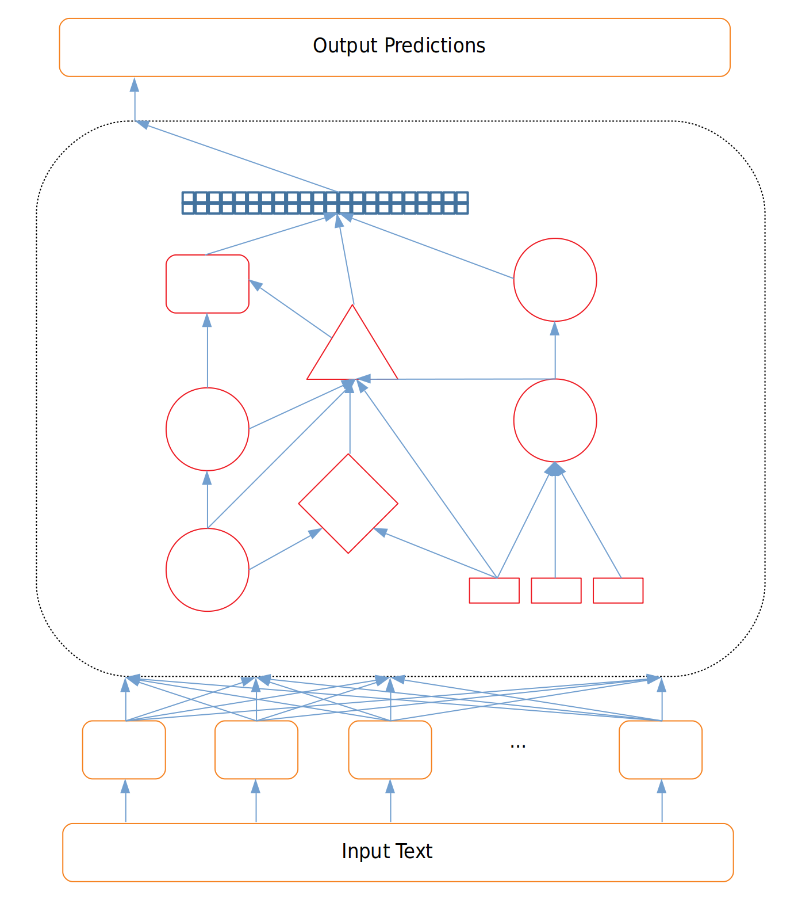
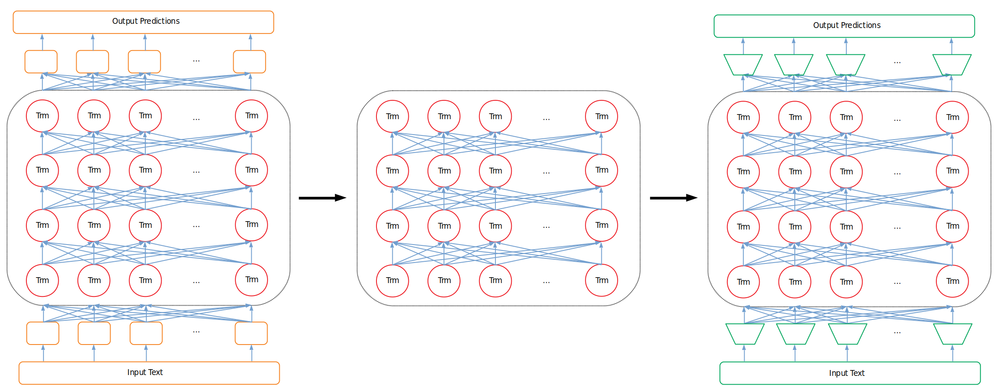
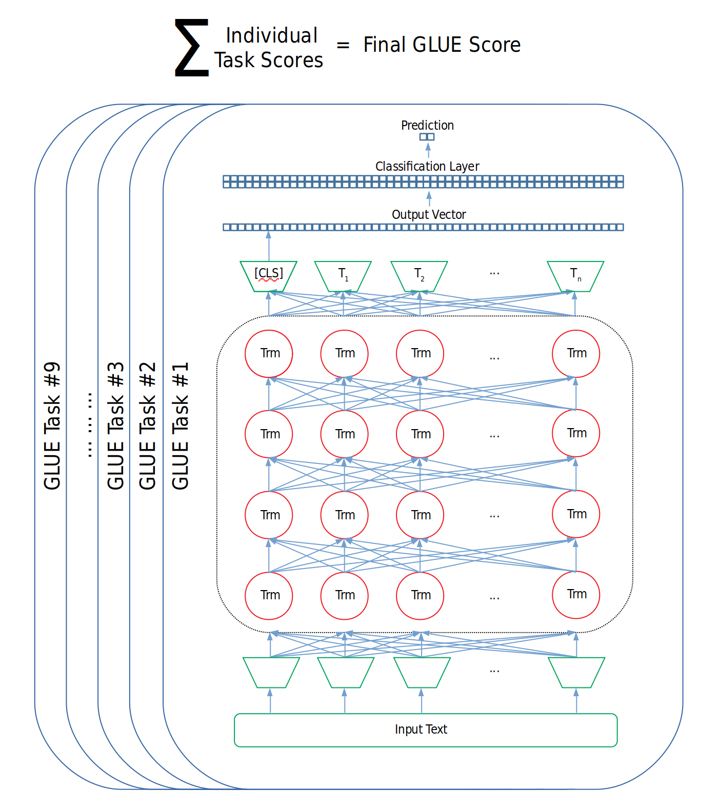
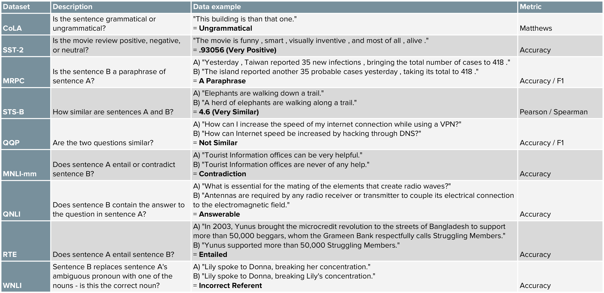
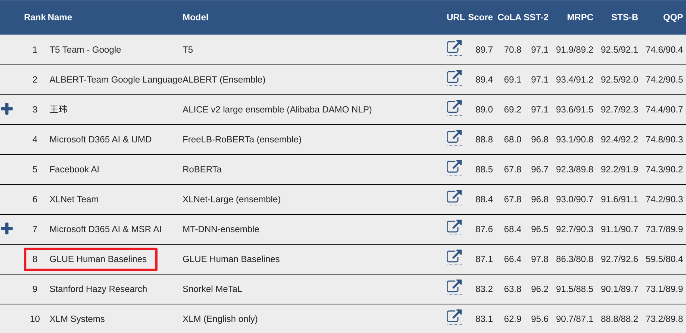
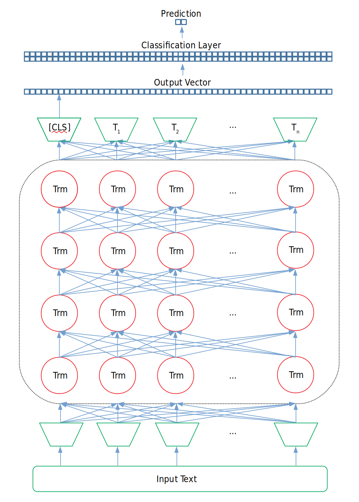

_본 글은 Chris McCormick과 Nick Ryan이 공동으로 작성한 [**GLUE Explained: Understanding BERT Through Benchmarks**](https://mccormickml.com/2019/11/05/GLUE/)를 저자의 허락을 받아 한국어로 옮긴 글입니다. 잦은 의역이 있으니 원문을 살려서 읽고자 하신 분들은 링크를 참조해주세요._

이번 글에서는 BERT를 비롯한 전이학습 기반 자연어 처리 모델들의 성능을 평가하기 위해 사용되는 벤치마크 **GLUE**에 대해 알아보도록 하겠습니다.


## 서론

**[GLUE](https://arxiv.org/pdf/1804.07461.pdf)**(General Language Understanding Evaluation) 벤치마크는 **"강건하고 범용적인 자연어 이해 시스템의 개발"**이라는 목적을 가지고 제작된 데이터셋입니다. 따라서 GLUE는 자연어 처리 모델을 훈련시키고, 그 성능을 평가 및 비교 분석하기 위한 데이터셋들로 구성되어 있습니다. 다양하고 해결하기 어려운 9개의 태스크 데이터셋으로 구성된 GLUE는 모델들의 **자연어 이해 능력**을 평가하기 위해 고안되었으며, 이제는 BERT와 같은 전이학습 모델들을 평가하기 위한 필수적인 벤치마크가 되었습니다.


## 자연어 처리 태스크들이 내 일이랑 무슨 상관인데?
대부분의 자연어 처리 태스크는 모델의 특정 언어 이해 능력을 평가하는데 사용될 수 있습니다. 예를 들어:

- **Named Entity Recognition**: 문장 내 특정 단어가 고유 명사, 기관명 혹은 엔티티인가?
- **Textual Entailment**: 두 문장이 주어졌을 때, 첫 번째 문장이 두 번째 문장을 수반하는가 혹은 위배되는가?
- **Coreference Resolution**: 문장 내 대명사 "it"이 존재하고 해당 대명사가 지칭할 수 있는 명사가 많을 때, "it"이 지칭하는 정확한 대상은 무엇인가?

대부분의 경우, 여러분은 BERT를 이용한 특정 태스크의 해결에만 관심을 가질 것입니다. 예를 들면 고객이 남긴 리뷰에 대한 감정을 예측하는 것과 같은 태스크 말이죠. 이러한 경우, 여러분은 모델이 **Coreference Resolution**에 어떤 성능을 보이는지에 대해서는 전혀 관심을 가지지 않을 것입니다.

그러나 모든 자연어 처리 태스크들은 언어적 측면에서 서로 연결되어 있다는 점을 이해하는 것이 중요합니다. 만약 여러분이 앞서 언급한 태스크가 아닌 고객이 남긴 리뷰에 대한 **감정 분석**에만 관심이 있더라도, 문장 내 대명사가 가리키는 바가 무엇인지를 잘 아는 모델들은, 즉 **Coreference resolution**을 해결할 수 있는 모델들은 고객 리뷰 내 모호한 명사들에 대해서도 효과적인 판단을 내릴 수 있을 것입니다. 이러한 이유 때문에 BERT와 같은 전이학습 모델들이 GLUE 벤치마크와 같이 다양한 자연어 처리 태스크에서 좋은 성능을 보인다는 것은 해당 모델들은 여러분이 수행하고자 하는 **"특정"** 태스크에도 효과적으로 적용될 수 있음을 의미하게 되는 것입니다.

## GLUE의 탄생 배경

과거 자연어 처리 모델들은 거의 대부분 하나의 특정한 문제를 잘 해결하기 위해 설계되었습니다. 따라서 **End-to-end**로 해당 문제를 푸는데에만 적합하게 훈련된 과거 모델들은 다른 문제 혹은 다른 데이터셋에 대해서 효과적인 성능을 보여주지 못하였습니다.

|  |
|:-----:|
| 특정 문제에 특화된 구조 |

이러한 모델들은 특정 문제 혹은 심지어 특정 데이터셋을 염두에 두고 설계되었기 때문에 해당 모델이 잘 훈련되었는지 확인하는 것은 굉장히 쉬운 일이었습니다. **"NER 모델이 NER을 잘 해결하고 있나요?"**와 같은 질문에만 답하면 됐기 때문이죠.

그러나 많은 연구자들이 **전이학습(Transfer Learning)**과 관련된 연구를 시작하고, 자연어 처리 내에서도 전이학습의 성공이 이어짐에 따라 모델을 평가하기 위한 새로운 방법론의 필요성이 대두되었습니다.

특정 문제**만을** 해결하기 위해 **End-to-end** 방식으로 학습된 **Single task model**들과 달리, 전이학습 모델들은 Deep한 모델을 이용해 자연어의 일반화된 이해를 중점으로 학습합니다. 즉, 전이학습 모델들은 사전학습을 통해 언어에 대한 일반적인 **이해** 능력을 가질 수 있게 되는 것이죠. 이처럼 사전학습을 통해 얻어진 자연어 이해 능력은 해당 모델을 특정 태스크를 수행하기 위해 **Fine-Tuning** 할 때 그 빛을 발하게 됩니다. 그 과정은 다음과 같습니다.

1. 사전학습에 사용되었던 입력층과 출력층을 기존 모델에서 제거합니다.

2. 입력층과 출력층을 해결하고자 하는 문제에 적합한 층으로 교체합니다.

3. 위 과정을 거쳐 변형된 모델을 n번의 에폭 동안 재학습시킵니다(Fine-Tuning). 이때 사전학습 모델에서 차용한 모델 중간부는 자연어를 잘 '이해'하는 파라미터를 지니고 있기 때문에 우리가 풀고자 하는 문제 해결에 큰 도움이 됩니다.

|  |
|:-----:|
| 초기 사전학습 구조, 학습된 언어 이해 모델, Fine-tuning 구조 |

위 과정이 전이학습의 핵심 아이디어입니다. 그리고 새로운 방식으로 학습된 전이학습 모델들이 등장할 때 마다, 중요한 질문이 함께 따라오게 되었습니다. **새 모델이 이전 모델들보다 더 좋은 성능을 보이는지 어떻게 평가할 수 있을까요?** 어떠한 단독 태스크도 해당 질문에 대한 답이 될 수는 없었습니다. 우리는 모델의 일반적인 언어 '이해' 능력과 더불어 Fine-Tuning을 통해 특정 태스크에 얼마나 좋은 성능을 낼 수 있는지를 평가하고 싶었기 때문이죠.

## GLUE의 탄생과 활용 예
이러한 물음에 답하기 위해 **뉴욕대학교** 연구진은 한 모델에 대해 여러 태스크들을 훈련 및 평가할 수 있는 GLUE 데이터셋을 선보였습니다. 이제 연구자들은 자신이 새로이 연구한 모델을 GLUE 데이터셋에 훈련시킨 후, GLUE 내 9개의 태스크에 각각 점수를 메겨 최종 성능 점수를 계산할 수 있게 되었습니다. GLUE 내에 존재하는 태스크를 모두 해결할 수만 있다면 모델은 어떠한 구조를 가져도, 내부적으로 어떠한 연산을 취해도 전혀 문제가 되지 않습니다.

|  |
|:-----:|
| GLUE Score 계산 |

GLUE 벤치마크는 도입 이후 자연어 처리 분야에 빠르게 자리를 잡았고, 이제 새로이 등장하는 전이학습 모델들의 대부분은 GLUE 벤치마크에 대한 성능 지표를 연구 결과로 함께 공개하고 있습니다. GLUE 벤치마크 덕분에 자연어 처리 연구자 및 엔지니어들은 전이학습 모델의 성능을 단 몇 개의 숫자를 통해 비교할 수 있게 되었습니다!

_역자주: 2019년 9월 기준 GLUE 내 태스크는 11개로 증가되었습니다._

## GLUE 내 태스크
뉴욕대학교 연구진들은 GLUE 벤치마크를 해결하기 어려운 다양한 자연어 처리 문제들로 구성하고자 했으며, 대부분의 태스크들은 이미 존재하던 데이터셋의 차용을 통해 제작되었습니다. 아래 표는 GLUE 내 태스크들에 대한 간략한 정보를 제공하고 있습니다. 이 [링크](https://docs.google.com/spreadsheets/d/1BrOdjJgky7FfeiwC_VDURZuRPUFUAz_jfczPPT35P00/edit?usp=sharing)를 통해 보다 자세한 정보를 확인하실 수 있습니다.

|  |
|:-----:|
| GLUE 내 Task의 요약표 |


## 전이학습 모델들은 인간과 비교해봤을 때 문제를 얼마나 잘 해결하고 있을까?
GLUE 팀은 [리더보드](https://gluebenchmark.com/leaderboard)에 **Human Baselines**을 함께 기록해두었습니다. Human Baselines 기록은 실제로 인간이 테스트 데이터셋에 존재하는 문제들을 풀고 얻었던 점수입니다. 그리고 이미 몇몇 모델들은 해당 베이스라인을 능가하는 성능을 달성하기도 했습니다. 

|  |
|:-----:|
| GLUE 리더보드: 빨간 네모는 Human Baselines |

## GLUE 데이터는 어디서 얻을 수 있나요?
GLUE 데이터를 다운로드 받기 위한 방법과 코드는 [스크립트](https://gist.github.com/W4ngatang/60c2bdb54d156a41194446737ce03e2e)에 잘 설명되어 있습니다.

또한 [노트북](https://colab.research.google.com/drive/1Qwbw9se6uE1Ib8_sMToTF3lh7qqXVC8B) 자료는 TensorFlow Datasets(tfds)을 이용해 GLUE 데이터셋을 확인하고, 선별적으로 다운로드 받을 수 있는 방법에 대해 설명합니다.

## GLUE 데이터에 모델을 테스트하는 방법
BERT는 기본적으로 두 문장을 입력으로 취할 수 있도록 설계*(두 번째 문장의 입력은 선택의 문제)*되었기 때문에 GLUE 데이터셋에 대해 훈련을 진행할 때에는 입력 구조를 바꿀 필요가 전혀 없습니다: 두 입력 문장은 **QQP** 태스크를 수행하기 위한 두 질문으로 대체될 수 있고, **CoLA** 태스크를 수행하기 위해 하나의 문장만 입력으로 넣을 수도 있으며, **QNLI** 태스크를 수행하기 위해 질문과 문단을 각각의 문장 입력 값으로 넣을 수도 있게 되는 것입니다.

그러나 태스크의 수행을 위해서는 사전훈련에 사용되었던 분류층을 제거하고, 이를 GLUE 태스크를 수행하기 위한 레이어로 변경해주어야 합니다. 물론 대부분의 경우 변경해주는 레이어 역시 **이진 분류 계층**일테고 말이죠. 예를 들어, 우리가 은닉층의 차원이 **768**인 **small-BERT**를 이용해 이진 분류를 수행하고자 한다면 분류층의 차원은 [hidden_layer_size, number_of_labels], 즉 [768, 2]가 될 것입니다. 그리고 BERT가 출력한 문장 토큰들 중 **[CLS]** 토큰이 분류층의 입력 값이 되어 문장 분류 태스크를 수행할 수 있게 됩니다. 

이제 분류에 사용되는 Loss를 추가적으로 이용해 BERT를 **Fine-Tuning** 할 수 있게 되었습니다. 아래 예시를 통해 위 과정을 다시 한 번 짚고 넘어가보도록 합시다!

|  |
|:-----:|
| GLUE 태스크에 훈련과 평가를 적용하기 위한 Fine-Tuning 구조 |

**Hugging face**가 제공하는 [transformers](https://github.com/huggingface/transformers) 라이브러리를 이용한다면, 우리는 다음과 같이 코드를 쉽게 작성할 수 있게 됩니다.

```python
# BERT는 입력 문장 내 존재하는 각각의  토큰을 768 차원으로 확장해 출력 
outputs = model(input_ids,
    attention_mask=attention_mask,
    token_type_ids=token_type_ids,
    position_ids=position_ids, 
    head_mask=head_mask,
)

# 분류 문제를 풀기 위해서는 [CLS] 토큰이 사용됨
pooled_output = outputs[1]

# 훈련을 위한 Dropout 계층 생성
dropout = nn.Dropout(hidden_dropout_prob)

# BERT의 최종 출력 값과 새로이 생성할 분류 계층 사이에 Dropout 적용
pooled_output = dropout(pooled_output)

# 분류 계층 생성
classifier = nn.Linear(hidden_size, num_labels)

# pooled output([CLS] 토큰)을 분류 계층에 전파 
logits = classifier(pooled_output)
```

위 코드는 [BertForSequenceClassification](https://colab.research.google.com/drive/1BGXKbHOLOuVK5-1W-d3bEEdRCrAw_t5H)의 구현 코드입니다. 이상 긴 글 읽어주셔서 감사합니다.