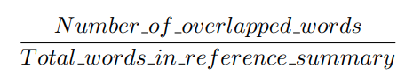
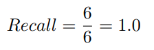
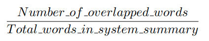
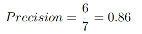
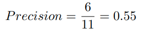
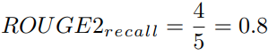
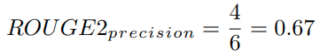

_본 글은 Northeastern University의 강의 자료 [**What is ROUGE and how it works for evaluation of
summarization tasks?**](http://www.ccs.neu.edu/home/vip/teach/DMcourse/5_topicmodel_summ/notes_slides/What-is-ROUGE.pdf)를 번역한 글입니다. 원문으로 읽고자 하시는 분들은 링크를 참조해주세요._

## ROUGE가 요약 모델의 성능을 평가하는 방법

[Chin-Yew Lin](https://scholar.google.com/citations?user=cDF07aYAAAAJ&hl=en)에 의해 고안된 ROUGE는 **Recall-Oriented Understudy for Gisting Evaluation**의 준말로 텍스트 요약 모델의 성능 평가 지표입니다. ROUGE는 **텍스트 자동 요약**, **기계 번역** 등 자연어 생성 모델의 성능을 평가하기 위한 지표이며, **모델이 생성**한 요약본 혹은 번역본을 사람이 미리 만들어 놓은 참조본과 대조해 성능 점수를 계산합니다. 

먼저 우리에게 다음과 같은 **시스템 요약**과 **참조 요약**이 있다고 가정해봅시다.

**시스템 요약 (모델 생성 요약)**:
> the cat was found under the bed

**참조 요약 (Gold standard, 대개 사람이 직접 만든 요약)**:
> the cat was under the bed

만약 모델의 성능 평가를 위해 **개별 단어**에만 집중한다면 모델이 생성한 **시스템 요약**과 사람이 만들어 놓은 **참조 요약** 간 겹치는 단어는 총 6개입니다. 그러나 이 **6**이라는 숫자는 **성능 지표 (Metric)**로 바로 사용하기에 적합하지 않은 수입니다. 우리는 정량적 지표로 사용할 수 있는 값을 얻기 위해 이 6이라는 숫자를 이용해 **Recall**과 **Precision**을 계산해야 합니다.

 

## ROUGE에서의 Precision과 Recall의 의미

ROUGE에서 **Precision**과 **Recall**은 아주 단순한 방법을 통해 구할 수 있습니다. 먼저 **Recall**은 **참조 요약본**을 구성하는 단어 중 몇 개의 단어가 **시스템 요약본**의 단어들과 겹치는지를 보는 점수입니다. **unigram**을 하나의 단어로 사용한다고 하면, ROUGE에서의 **Recall**은 다음과 같이 계산될 수 있습니다.

그리고 앞서 살펴본 예제에서의 **Recall** 점수는 다음과 같습니다.

이 점수는 **참조 요약본** 내 모든 **unigram**이 모델이 생성한 **시스템 요약본**에 등장했다는 것을 의미합니다. 이는 언뜻 보기에 무척 좋은 점수처럼 느껴질 수 있습니다. 그러나 해당 점수 역시 요약 모델의 성능을 대변하지는 못합니다. 만약 모델이 생성했던 **시스템 요약본**이 **엄청나게 긴** 문장이었을 경우 **참조 요약본**과 크게 관련이 없을지라도 **참조 요약본**의 단어 대부분을 포함할 가능성이 커지게 되기 때문입니다.

보다 쉽게 이야기하자면 모델이 자신이 알고 있는 모든 단어를 생성해 요약본을 만들게 되면, 어떻게든 참조 요약본을 구성하는 단어들을 요약본에 포함할 수 있게 될 것이라는 것이죠.

이러한 문제를 해결하기 위해 우리는 **Precision**을 계산할 필요가 있습니다. **Precision**은 **Recall**과 반대로 모델이 생성한 **시스템 요약본** 중 **참조 요약본**과 겹치는 단어들이 얼마나 많이 존재하는지를 보고자 합니다. 이는 다음 식을 통해 구할 수 있습니다.

위 예제에 대해 **Precision**을 계산하자면, **Precision**은 모델이 생성한 문장을 구성하는 7개 단어 중 6개의 단어만 참조 요약과 연관 있는 단어로 보게 됩니다. 그리고 이에 따라 다음과 같은 점수를 지니게 되죠.

이제 **시스템 요약본** 문장을 다음과 같이 바꿔봅시다.

**시스템 요약 2:**
> the tiny little cat was found under the big funny bed

이제 **Precision** 점수는 다음과 같아집니다.

그렇게 좋은 결과 같아 보이지는 않네요! 만약 여러분이 **간결한** 요약문을 생성해내야 하는 상황이라면 **Precision**은 아주 좋은 성능 지표로 사용될 수 있습니다. 그러나 위 예제의 경우, 모델이 생성한 **시스템 요약** 문장 내에 **불필요한 단어**가 너무 많이 존재하기 때문에 좋은 점수를 받을 수 없게 됩니다.

따라서 보다 정확한 모델의 성능 평가를 위해서는 **Precision**과 **Recall**을 모두 계산한 후, **F-Measure**를 측정하는 것이 바람직합니다. 만약 여러분의 모델이 여러 제약 조건들로 인해 어떻게든 **간결한** 요약을 생성해내고 있다면, **Precision**은 성능 평가에 크게 중요한 고려 사항이 아니게 되므로 **Recall**만 사용해도 괜찮은 상황이 되게 됩니다.

 

## ROUGE-N, ROUGE-S, 그리고 ROUGE-L

**ROUGE-N**, **ROUGE-S**, **ROUGE-L**은 모두 요약본의 **일정 부분**을 비교하는 성능 지표입니다. 예를 들어, **ROUGE-1**은 **시스템 요약본**과 **참조 요약본** 간 겹치는 **unigram의 수**를 보는 지표이며, **ROUGE-2**는 **시스템 요약본**과 **참조 요약본** 간 겹치는 **bigram의 수**를 보는 지표입니다. 

이제 다시 위 예시들을 다시 살펴보도록 합시다. 우리는 현재 **ROUGE-2**를 이용해 **Precision**과 **Recall** 스코어를 계산하고자 하는 상황입니다.

**시스템 요약**:
> the cat was found under the bed

**참조 요약**:
> the cat was under the bed

**시스템 요약 (bigrams)**:
> the cat, cat was, was found, found under, under the, the bed

**참조 요약 (bigrams)**:
> the cat, cat was, was under, under the, the bed

예시로부터 도출된 **bigram**들을 사용해 계산한 **ROUGE-2**의 **Recall** 점수는 다음과 같습니다.

모델은 **참조 요약본**에 속한 5개의 **bigram** 중 4개의 **bigram**을 생성해냈습니다. 꽤나 괜찮은 결과네요. 이제 **ROUGE-2**의 **Precision** 점수를 계산해봅시다.

위 **Precision**은 **시스템 요약본** 중 **67%**의 **bigram**이 **참조 요약본** 내 **bigram**과 겹친다는 것을 의미합니다. 역시 나쁘지 않은 결과네요. 여기서 우리는 확률적 관점에서 봤을 때, **시스템 요약본**과 **참조 요약본**이 길어질수록 **겹치는 bigram**의 수가 적어질 것이라는 사실을 짚고 넘어갈 필요가 있습니다. 그리고 특히 원문을 그대로 요약에 사용하지 않는 **Abstractive Summarization**과 같은 태스크의 경우 그 정도가 더 심할 것입니다.

## 기타 ROUGE 지표들에 대한 간략한 설명

이제 몇 가지 다른 ROUGE 성능 지표들에 대해 간단한 설명을 드린 후, 글을 마치도록 하겠습니다.

- **ROUGE-N**: unigram, bigram, trigram 등 문장 간 **중복되는 n-gram**을 비교하는 지표입니다.
- **ROUGE-L**: [LCS](https://en.wikipedia.org/wiki/Longest_common_subsequence_problem) 기법을 이용해 **최장 길이**로 매칭되는 문자열을 측정합니다. LCS의 장점은 **ROUGE-2**와 같이 단어들의 **연속적 매칭**을 요구하지 않고, 어떻게든 **문자열** 내에서 발생하는 매칭을 측정하기 때문에 보다 유연한 성능 비교가 가능하다는 것입니다.
	- Reference: police killed the gunman
	- System-1: **police** kill **the gunman**
	- System-2: **the gunman** kill **police**
	- **ROUGE-N**: System-1 = System-2 ("police", "the gunman")
	- **ROUGE-L**:
		- System-1 = **3/4** ("police the gunman")
		- System-2 = 2/4 ("the gunman")
- **ROUGE-S**: 특정 **Window size**가 주어졌을 때, **Window size** 내에 위치하는 단어쌍들을 묶어 해당 단어쌍들이 얼마나 중복되게 나타나는 지를 측정합니다. 때문에 해당 기법을 **Skip-gram Co-ocurrence** 기법이라 부르기도 합니다. 
	- 예를 들어, **Skip-bigram**은 최대 **2칸** 내에 존재하는 단어들을 쌍으로 묶어, 해당 쌍들이 참조 문장과 생성 문장 간 얼마나 중복되는게 나타나는지를 측정합니다. 
	- e.g.) **"cat in the hat"**이라는 문장이 있다고 해봅시다. 
	- 해당 문장에서 발생할 수 있는 **Skip-bigram**은 "cat in", "cat the", "cat hat", "in the", "in hat", "the hat"이 됩니다.

**ROUGE** 성능 지표에 대해 더 깊은 이해를 하시길 원하시는 분들은 원 저자의 [**논문**](https://www.aclweb.org/anthology/W04-1013/)을 참조하시는 것이 좋습니다. 또한 다양한 **ROUGE** 성능 지표들 중 어떠한 지표를 사용할 것인지는 여러분이 평가하고자 하는 모델의 **태스크**에 달려있습니다!

### Reference

- [ROUGE: A Package for Automatic Evaluation of Summaries](https://www.aclweb.org/anthology/W04-1013/)
- [Original author's slides](https://pdfs.semanticscholar.org/60b0/5f32c32519a809f21642ef1eb3eaf3848008.pdf)
- [What is ROUGE and how it works for evaluation of
summarization tasks?](http://www.ccs.neu.edu/home/vip/teach/DMcourse/5_topicmodel_summ/notes_slides/What-is-ROUGE.pdf)