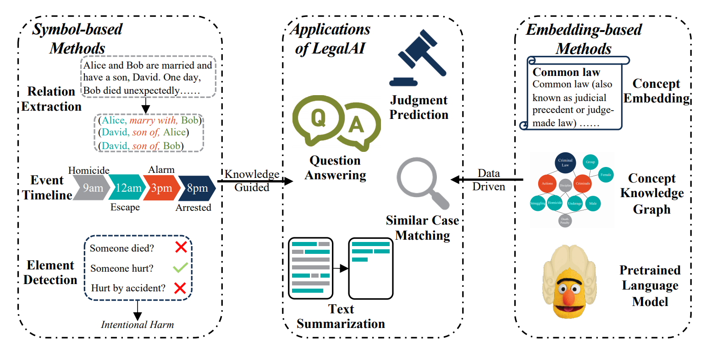
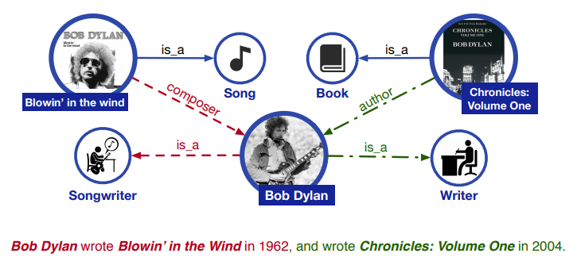
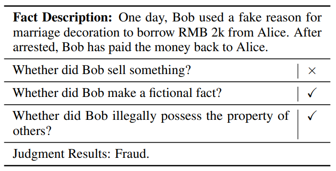
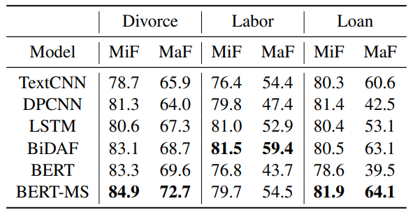
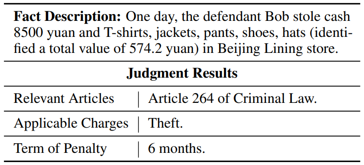
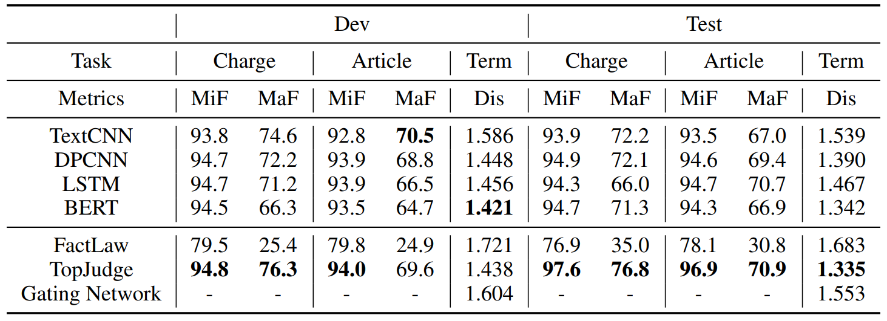
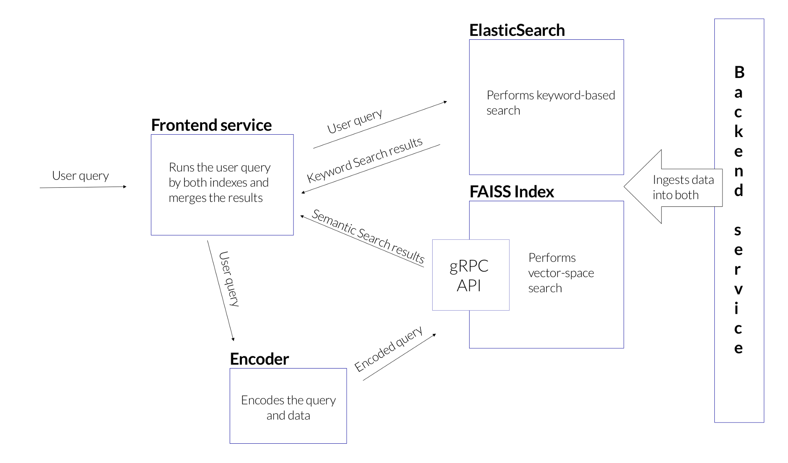
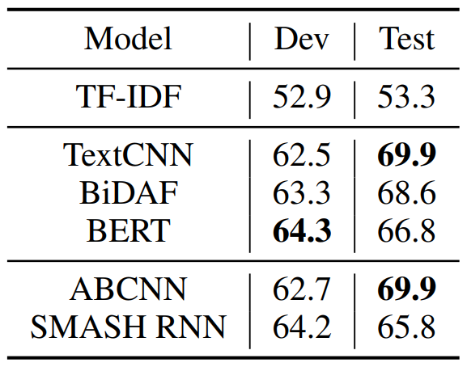
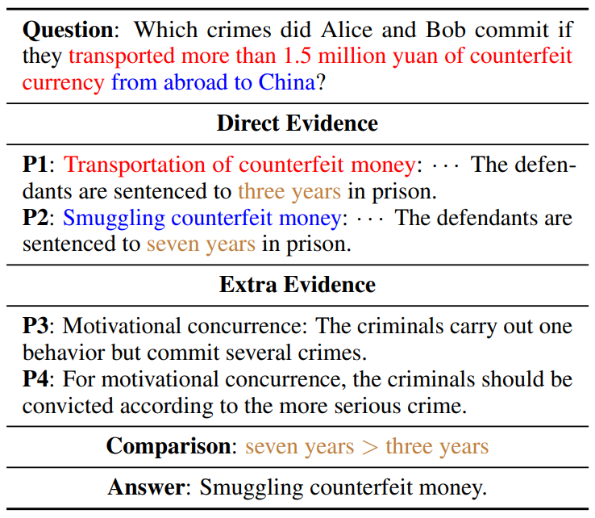
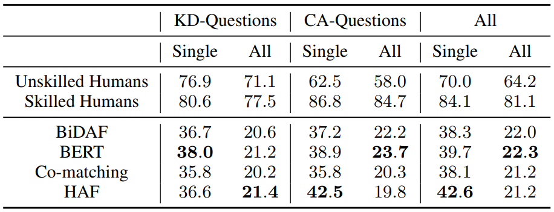

_본 글은 2020년도 ACL에 제출된 논문 [**How Does NLP Benefit Legal System: A Summary of Legal Artificial Intelligence?**](https://arxiv.org/abs/2004.12158)를 보고 기록을 위해 정리한 글입니다. 보다 자세한 내용이 궁금하신 분들은 원 논문을 참조해주시기 바랍니다._

## 1. 서론

|  |
|:--:| 
| _Legal AI의 전반적 태스크_ |

**법률 인공지능(이하 법률 AI)**은 사람들이 처리하는 **법률 태스크**를 도울 수 있는 인공지능 기술을 적용하기 위한 연구입니다. 법률 도메인에서 **판결문**, **계약서**, **법적 자문** 등 대부분의 자료는 **텍스트** 형태로 표현됩니다. 따라서 법률 AI 태스크들은 주로 **자연어 처리** 기술에 의존하고 있습니다.

법률 AI는 법률 시장에서 법조인들의 **반복적인 업무**를 줄여줄 수 있는 중요한 역할을 수행할 수 있습니다. 법조계에 존재하는 많은 태스크들은 법률 전문가의 **전문 지식**과 **다양한 법률 문서의 철저한 이해**를 필요로 합니다. 때문에 일을 수행하는데 필요한 문서를 찾고, 이해하는 일은  전문가에게도 많은 시간을 소요되는 하는 일입니다. 

그러므로 **잘 설계된 법률 AI**는 이러한 반복적인 작업에 들어가는 시간을 줄일 수 있고, 이를 통해 **법조계의 발전**에 이바지 할 수 있습니다. 게다가 법률 AI는 법률 지식에 친숙하지 않은 일반인들에게 **신뢰할 만한 자료를 제공**하는 형태로 발전할 수도 있으며, 이를 통해 법적 도움이 필요한 이들에게 보다 저렴한 가격에 서비스를 제공하게 될 수도 있습니다.

지난 수 십년간 많은 연구자들이 법률 AI를 발전시키기 위해 노력해왔습니다. 초창기 연구들은 당시 연산량의 한계 때문에 **잘 정비된 규칙**과 **피쳐 기반의 방식**을 활용하였습니다. 그리고 최근의 연구자들은 **Deep Learning의 빠른 발전**으로 인해, 해당 기법들을 법률 AI에 적용하려는 시도를 하고 있습니다. 또한 법률 AI의 발전을 위해 다양한 **벤치마크 데이터셋**이 등장하기도 하였는데, 이를 기반으로 **판결 예측**, **법률 문서 생성**, **법률 엔티티 추출 및 분류**, **법률 Q&A**, **법률 문서 요약** 등 다양한 태스크가 생겨났습니다.

앞서 언급했듯, 법률 AI는 여러 연구자들의 노력을 통해 많은 발전을 이루어 왔었습니다. 이러한 발전사를 간단히 요약하자면 **해석 가능한**, **잘 정돈된** 기호를 활용해 법률 태스크를 해결하고자 하는 시도가 있는가하면, **신경망 기반**의 모델을 활용한 성능 향상에 초점을 둔 시도들도 있습니다. 더 자세히 이야기하자면, 기호를 활용하는 방법론들은 **해석 가능한 법률 지식**을 활용해 법률 문서 내 등장하는 **기호들 간 관계**를 추론하기 위해 사용됩니다. 반면 **신경망을 활용한 임베딩 기반 모델**들은 큰 규모의 데이터로부터 태스크 수행을 위한 **잠재 피처**를 학습하기 위해 사용됩니다. 

그리고 두 방법론에는 일장일단이 존재합니다.**기호 기반의 모델**은 효과적이지 않을 수 있지만 결과에 대한 해석이 가능하다는 장점이 있습니다. 이에 반해 **임베딩 기반 모델**은 좋은 성능을 자랑하지만, 일반적으로 해석하기 어려운 경우가 많고 이로 인해 모델이 **젠더 편향**, **인종 차별** 등 윤리적 문제를 법률 시스템에 투영할 수도 있다는 문제가 있습니다. 따라서 이러한 개별적 단점들이 현존하는 모델들을 **실세계**에 적용하기 어렵게 만들고 있습니다.

다음으로 현재 법률 AI에 있어 **임베딩 기반**, **기호 기반 방법론**을 막론하고 중요하게 여겨지고 있는 세 가지 사안을 요약해보았습니다.

1. **지식 모델링**: 법률 문서는 형식적으로 잘 작성된 문서로, 문서 내에 많은 **도메인 지식**과 **법률 개념**을 포함하고 있습니다. 따라서 이러한 **법률 지식**을 모델링을 통해 잘 활용하는 것은 매우 중요합니다.
2. **법률적 추론**: 자연어 처리 내 많은 태스크들이 추론을 필요로 하지만, 법률 AI 태스크에는 다소 다른 점이 있습니다. 법률적 추론은 **법에 정의된 규칙**들을 엄격하게 따라야 한다는 것입니다. 그러므로 **올바른 법률 추론**을 위해서는 **기정의된 규칙**과 **AI 기술**을 잘 혼합하는 것이 중요합니다.
3. **해석 가능성**: 법률 AI에 의해 내려진 결정들은 실제 서비스에 적용되기 위해 **해석 가능성**을 지녀야 합니다. 그렇지 않다면 공정성에 해가 갈 위험이 있습니다. 따라서 법률 AI에 있어 해석 가능성은 성능만큼이나 중요한 요소입니다.

## 2. 임베딩 기반 방법론

먼저 _Representation Learning_ 이라고도 불리우는 **임베딩 기반 방법론**들에 대해 살펴봅시다. 임베딩 기반 방법론들은 **법률적 사실 정보**와 **지식**을 임베딩 공간에 표현하는 것에 초점을 두고 있습니다. 그리고 임베딩 이후, **Deep Learning 기법**을 활용해 태스크를 수행합니다.

### 2.1 문자, 단어, 개념 임베딩

**문자** 및 **단어** 임베딩은 이산적인 텍스트를 연속적인 벡터 공간으로 임베딩하는데 활용되는 기법입니다. 여러 임베딩 기법들은 태스크 성능을 통해 그 효과를 증명해왔기 때문에 법률 AI의 태스크 수행에 있어서도 아주 중요합니다.

그러나 법률 문서에 등장하는 **전문 용어**들의 의미를 모델이 곧바로 학습하는 것은 현재까지는 불가능에 가깝습니다. 이처럼 **전문 용어**를 학습하는 어려움을 해결하기 위해 우리는 **문법 정보**와 **법률 정보**를 함께 임베딩시키는 방법을 고려해볼 수도 있을 것입니다. 앞서 언급했듯, 법률 AI에 있어 많은 결과들은 **법률 규칙**과 **지식**에 의해 결정되기 때문에 **지식 모델링**은 매우 중요한 요소입니다.

이에 따라 **지식 그래프** 기법이 법률 도메인에서 많은 각광을 받고 있지만, 지식 그래프를 실용적으로 적용하기에는 두 가지 문제가 있습니다. 첫 번째 문제는 법률 AI에 있어 지식 그래프를 그리는 것이 매우 **복잡하다**는 것입니다. 대부분의 경우 법률 지식을 그래프로 미리 그려둔 레퍼런스가 없기 때문에, 연구자들은 이를 처음부터 작성해야 합니다. 또한 **국가마다 다른** 법률 시스템과 개념 및 의미를 지니기 때문에 일반적으로 활용될 수 있는 법률 지식 그래프를 그리는 일도 쉽지 않습니다.

두 번째 문제는 **법률 지식 그래프**가 일반적으로 자연어 처리에 있어 사용되는 지식 그래프와 **다른 형태**를 지닌다는데에 있습니다. 보통의 지식 그래프는 **엔티티**와 **개념** 간 **관계**에 대해서 다루지만, 법률 AI의 지식 그래프는 **법률 개념을 설명**하는데 더 초점이 맞추어져 있습니다. 이러한 두 가지 문제는 법률 AI에 있어 **법률 지식의 임베딩**을 어렵게 만들고 있으며, 앞으로 이런 문제를 해결하기 위한 연구를 수행해볼 수 있을 것입니다.

### 2.2 사전 훈련 언어 모델

**BERT**와 같은 **사전 훈련 언어 모델 (이하 PLM)**은 최근 자연어 처리의 많은 분야에서 활약하고 있습니다. **PLM**의 일반적 성공으로 보아, 법률 AI에도 **PLM**을 활용하는 것은 매우 합리적 선택입니다. 그러나 PLM을 학습하는데 사용된 코퍼스와 법률 텍스트에는 큰 차이가 존재합니다.

때문에 일반 코퍼스로 학습된 **PLM**을 바로 **법률 태스크**에 활용하게 되면 매우 실망스러운 결과를 얻게 됩니다. 이러한 성능 차이는 법률 텍스트에 내포된 **수많은 전문 용어**와 **지식**들에서 기인합니다. 그리고 이러한 문제를 해결하기 위해 중국어로 작성된 법률 문서에 언어 모델을 사전 훈련시킨 [**PLM**](https://github.com/thunlp/OpenCLaP)이 고안되기도 하였습니다. 이처럼 **법률 코퍼스로 학습된 PLM**은 일반 PLM 보다 법률 태스크에 있어 훨씬 뛰어난 성능을 보였습니다.

법률 AI에 있어 PLM을 더 발전시키기 위해 연구자들은 **지식 정보**를 PLM에 통합해볼 수도 있을 것입니다. 그리고 이는 PLM이 법률 개념을 활용해 추론을 할 수 있는 능력 발전에 도움이 됩니다. 일반 도메인에서 **지식 정보**을 모델에 통합하는 많은 연구가 이미 존재하기 때문에, 이러한 연구를 잘 활용한다면 법률 지식도 모델에 잘 통합시킬 수 있을 것입니다.

|  |
|:--:| 
| _언어 모델에 지식 정보를 임베딩하는 예 (from. ERNIE)_ |

_역자주: 본 논문을 제출한 칭화대학교는 기존의 **BERT**에 **지식 정보**를 추가로 임베딩 시키면 좋은 성능을 보일 수 있다고 주장한 [**ERNIE**](https://arxiv.org/abs/1905.07129?utm_source=feedburner&utm_medium=feed&utm_campaign=Feed%253A+arxiv%252FQSXk+%2528ExcitingAds%2521+cs+updates+on+arXiv.org%2529)를 고안한 학교이기도 합니다. 이처럼 칭화대학교는 **Knowledge Embedding**에 대한 중요성을 여러 논문을 통해 강조하고 있는 것으로 보입니다._

## 3. 기호 기반 방법론

이번에는 구조화된 예측을 수행하는 **기호 기반의 방법론**들을 살펴봅시다. 기호 기반의 방법론들은 법률 도메인의 **기호**와 **지식**을 활용해 법률 태스크를 수행하고자 합니다. **사건**과 **관계**와 같은 법률적 기호 지식은 모델에 **해석 가능성**을 부여합니다. 그리고 더 나은 성능을 위해 기호 기반의 방법론들에 **Deep Learning 기법**들을 적용해볼 수도 있습니다. 

### 3.1 정보 추출

**정보 추출 (이하 IE)**은 자연어 처리에 있어 매우 널리 연구된 태스크입니다. **IE**는 텍스트로부터 **가치있는 정보**를 추출하고자 하는 태스크입니다. 그리고 **Named Entity Recognition**, **Relation Extraction** 그리고 **Event Extraction**과 같이 IE에도 다양한 서브 태스크들이 있습니다.

법률 AI에 있어도 **IE**는 많은 연구자들의 관심을 끌었습니다. **법률 문서의 특수성**을 활용하기 위해 연구자들은 **법률 NER**을 위해 **온톨로지** 등의 정보를 활용하였습니다. 또한 법률 문서에서 **사건**과 **관계** 등의 정보를 추출하기 위해 **규칙 기반**, **CRF**, **SVM**, **CNN**, **GRU** 등 다양한 자연어 처리 기법이 활용되기도 하였습니다. 

현존하는 연구들은 **IE**의 성능을 끌어올리는데 초점이 맞추어져 있었지만, 여기서는 모델로부터 **추출된 정보** 자체에 관심을 기울여봅시다. **추출된 기호**들은 **법률적 기반**을 가지고 있기 때문에 **법률 어플리케이션**에 **해석 가능성**을 부여할 수 있습니다. 아래 추출된 **법률 기호**들이 법률 AI에 있어 어떻게 **해석 가능성**을 부여할 수 있는지 예시를 한 번 살펴봅시다.

_**관계 추출과 상속 분쟁**_

**상속 분쟁**은 **민법 유형의 케이스**로 상속권의 분배에 대해 주로 다루게 됩니다. 따라서 **사망한 사람과 더 가까운 관계**의 이해 관계자들이 더 많은 유산을 상속 받을 수 있도록, **관계를 잘 파악**하고 **추출**하는 것이 매우 중요합니다. 따라서 상속 분쟁에 있어서의 **관계 추출**은 **판결 결과**에 **근거**를 제공할 수 있으며, 결과적으로 성능 향상에까지 기여할 수 있게 됩니다.

_**사건 타임라인 추출과 형사 사건의 판결 예측**_

형사 사건에서는 종종 여러 이해 관계자가 **집단 범죄**에 연루될 수 있습니다. 이러한 경우 어떤 사람이 **해당 범죄에 가장 큰 책임**이 있는지 결정하기 위해, 사건에 연루된 모든 관계자들이 **사건이 진행되는 동안** 무엇을 했는지를 파악할 필요가 있습니다. 그리고 이러한 사건들이 일어난 순서 역시 매우 중요합니다. 예를 들어, 패싸움의 경우 처음으로 싸움을 시작한 사람이 가장 큰 책임을 물어야 할 것입니다. 따라서 **잘 설계된 사건 타임라인 추출 모델**은 형사 사건의 판결 예측을 위해 필수적입니다.

앞으로 우리는 **추출된 정보**를 법률 AI에 활용하는 방법에 대해 고민할 필요가 있습니다. 해당 정보들을 어떻게 활용하느냐는 태스크의 요구 사항에 따라 다를 것이며, 어떻게 사용되든 이러한 정보들은 **해석 가능성**을 제공해준다는 점에서 이점이 있습니다.

### 3.2 법률적 요소 추출

자연어 처리에서 활용되는 일반적인 기호 외에도 법률 AI에는 이른바 **법률적 요소**라고 불리우는 특별한 기호들이 있습니다. 법률적 요소들을 추출한다는 것은 주로 **누군가 살해당했다거나**, **무언가가 도난 당했다거나**와 같은 **범죄 행위**에 초점이 맞추어져 있습니다. 우리가 이러한 요소를 잘 활용한다면 **범죄자가 누구인지** 바로 특정할 수도 있습니다. 즉, 이러한 요소들은 **판결 예측**에 있어 **성능 향상**에 기여할 뿐만 아니라, 모델이 보다 해석 가능해지도록 도와줍니다.

|  |
|:--:| 
| _법률 요소 추출 태스크_ |

**요소 추출**에 대한 보다 깊은 분석을 위해 Shu et al.(2019)에서는 **이혼 분쟁**, **노동 분쟁** 그리고 **대출 분쟁** 등 세 개의 서로 다른 케이스에서 **법률 요소**를 추출할 수 있는 데이터셋을 구축하였습니다. 태스크는 **특정 요소**가 만족되었는지 아닌지의 **이진 분류**와, 판결 결과 예측하는 **멀티 라벨 분류** 문제로 설정되어 있습니다.

우리는 해당 데이터셋에 대해 여러 모델들의 성능을 측정하기 위해 **TextCNN**, **DPCNN**, **LSTM**, **BiDAF** 그리고 **BERT** 등 다양한 모델을 구현하였습니다. **BERT**의 경우 일반적인 코퍼스에 사전 학습된 BERT와, 법률 문서를 활용해 사전 학습된 **BERT-MS** 두 가지를 활용하였습니다. 

|  |
|:--:| 
| _법률 요소 추출 태스크 결과_ |

성능을 보았을 때, **법률 도메인 코퍼스에 사전 학습된 BERT**가 더 좋은 성능을 보여주는 것이 확인됨에 따라 법률 AI에 있어 이러한 사전 학습이 중요하다는 사실을 확인할 수 있었습니다. 위 결과를 보면, **법률적 요소**들을 추출하는데 있어 자연어 처리 모델들이 뛰어난 성능을 보임이 확인되었지만 이러한 요소들을 어떻게 잘 활용할지에 대한 연구는 여전히 더 진행이 되어야 합니다.

## 4. 법률 AI 어플리케이션

이제 법률 AI에서 활용되는 전형적인 어플리케이션인 **판결 예측**, **유사 케이스 매칭** 그리고 **법률 Q&A**에 대해 알아보도록 하겠습니다. **판결 예측**과 **유사 케이스 매칭**은 각각 **Civil Law**와 **Common Law** 체계에 핵심적으로 기능할 수 있는 어플리케이션이며, **법률 Q&A**는 법률 지식이 부족한 이들에게 도움을 줄 수 있는 어플리케이션입니다.

### 4.1 판결 예측

|  |
|:--:| 
| _판결 예측 태스크_ |

**판결 예측**은 법률 AI에 있어 아주 중요한 태스크이며, 특히 **Civil Law 체계**를 따르는 국가들에게 필수적입니다. **Civil Law 체계**에서 판결 결과는 **사건 내용**과 **법률 조항**들에 의해 결정됩니다. 사람들은 조항을 어겼을 때 **법적 제재**를 받게 됩니다. 따라서 **판결 예측**은 **사건 내용**과 **Civil Law 체계 하 법률 조항**들을 활용해 판결을 예측하는데 초점이 맞추어져 있습니다. 우리나라, 프랑스, 독일, 일본 그리고 중국 등이 Civil Law 체계를 따르기 때문에 이러한 국가들에서 **판결 예측**은 매우 중요합니다.

**관련 연구**

**판결 예측**은 오랜 역사를 지니고 있습니다. 초기 연구들은 **수학적 혹은 통계적 모델**을 활용해 **법률 케이스를 분석**하고자 했습니다. **수학적 방법론**과 **법률 규칙**들을 활용하면 결과를 보다 해석 가능하게 할 수 있습니다.

중국어 판결 예측의 경우, 2018년 Xiao가 **판결 예측 모델**의 발전을 위해 중국어로 기록된 큰 규모의 판결 예측 데이터셋 [**C-LJP**](https://www.researchgate.net/publication/326264143_CAIL2018_A_Large-Scale_Legal_Dataset_for_Judgment_Prediction)을 구축하였습니다. 해당 데이터셋은 **268 만개**의 **법률 문서**를 지니고 있어, **중국어 판결 예측**의 벤치마크 데이터셋이 되었습니다. 이러한 **C-LJP**는 **관련 조항 예측**, **범죄 종류 예측** 그리고 **형량 예측** 등 3개의 서브 태스크를 지니고 있습니다. 여기서 첫 두 태스크는 **멀티 라벨 분류** 태스크이며, **형량 예측**은 **회귀** 태스크입니다. 영어로 된 판결 예측 데이터셋 또한 존재하지만 크기가 제한적입니다.

신경망의 발전과 함께 많은 연구자들은 **Deep Learning** 기술을 활용해 **판결 예측**을 수행하고자 했습니다. 여기서 연구 방향이 다시 두 갈래로 나뉘는데 첫 번째는 새로운 모델을 활용해 **성능을 향상**시키고자 하는 것이었고, 두 번째는 **법률 지식**과 **특성**을 활용한 **판결 예측**을 수행하는 것이었습니다.

**실험 및 분석**

우리는 판결 예측의 최신 동향을 살펴보기 위해 **C-LJP**에 대해 여러 실험을 진행해보았습니다. 먼저 자연어 처리 모델들인 **TextCNN**, **DPCNN**, **LSTM** 그리고 **BERT**를 활용해 실험을 진행하였고, 이후에는 판결 예측을 위해 특별히 고안된 **FactLaw**, **TopJudge** 그리고 **Gating Network**를 활용해 실험을 진행하였습니다.

|  |
|:--:| 
| _판결 예측 태스크 결과_ |

결과를 살펴보니 대부분의 모델들이 **자주 등장하는 조항 및 범죄**의 분류에서는 뛰어난 성능을 보였지만, **간헐적으로 등장하는 라벨**에 대해서는 좋은 성능을 보이지 못했습니다. 또한 **BERT**가 좋은 성능을 보이지 못한다는 사실도 확인할 수 있었는데, 이는 법률 문서 특성상 문서의 길이가 매우 길기 때문에 발생하는 현상입니다. **BERT**가 입력으로 취할 수 있는 문서의 최대 길이는 **512 토큰**입니다. 그러나 **C-LJP** 데이터셋의 통계를 확인해 본 결과 **가장 긴 길이의 문서는 56,694개의 토큰**을 지녔으며, 전체의 **15%**에 해당하는 문서들이 **512 토큰을 초과하는 길이**를 지녔습니다.

또한 임베딩 기반 방법론들이 뛰어난 성능을 보이기는 하지만, 판결 예측에 있어서는 **기호 기반의 방법**과 **임베딩 기반 방법**을 혼합해 사용할 필요가 있습니다. **TopJudge**를 예로 들어 봅시다. 해당 모델은 **판결 예측 태스크**를 위해 **토폴로지**를 구축한 후, **TextCNN**을 활용해 **사건 개요**를 인코딩한 모델입니다. 이처럼 두 방법론을 적절히 활용한 **TopJudge**는 판결 예측에 있어 좋은 성능을 기록하였습니다. 단순 **TextCNN** 만을 활용한 모델과 비교해봤을 때, **TopJudge**가 보여준 성능 개선은 **법률 AI**에 있어 두 방법론을 적절히 조합해 활용하는 것이 매우 중요하다는 사실을 증명하였습니다.

더 나은 성능의 **판결 예측 모델**을 만들기 위해 우리는 다음과 같은 연구를 더 진행해야 합니다.

1. **긴 길이의 법률 문서**로부터 정보를 얻기 위해 법률 문서를 **이해**하고, **추론**할 수 있는 기법이 추가적으로 연구되어야 합니다.
2. **자주 등장하지 않는 라벨**도 잘 구분해낼 수 있도록 **Few-shot Learning**에 대한 연구가 진행되어야 합니다.
3. 실제 법률 시스템에 모델을 적용하기 위해서는 **해석 가능성**이 존재해야 합니다. 그리고 **기호 및 지식 기반의 방법론**을 결합해 활용하는 것이 이러한 **해석 가능성**에 도움이 될 수 있습니다.

### 4.2 유사 케이스 매칭

|  |
|:--:| 
| _일반적인 시맨틱 매칭 [사례](https://blog.onebar.io/building-a-semantic-search-engine-using-open-source-components-e15af5ed7885)_ |

미국, 캐나다, 인도와 같이 **Common Law 체계**를 따르는 국가들에서는 판결이 **과거에 존재했던 유사 판례**에 의해 결정됩니다. 따라서 **가장 유사한 케이스를 인식하고 찾는 일**은 **Common Law 체계**의 판결에 있어 매우 중요한 태스크입니다.

**유사 케이스 매칭** 태스크는 이름 그대로 **과거의 가장 유사한 사건**을 찾는 작업으로, **유사도**의 기준은 다양할 수 있습니다. 유사한 케이스를 찾기 위해서는 **사건 간 관계**를 모델링할 수 있어야 하는데 이는 **사실 관계**, **사건**, **법률** 등의 단위가 될 수 있습니다. 즉, **유사 케이스 매칭**은 **시맨틱 매칭**의 한 형태이며 **법률 IR**에 도움을 줄 수 있는 태스크입니다.

**관련 연구**

전통적은 **IR**은 **TF-IDF**, **BM25** 등 통계 모델을 활용해 **단어-단위 유사도**를 계산하는데 초점이 맞추어져 있었습니다. 어느 연구자들은 **단어 단위 매칭** 뿐만 아니라 **문서의 메타 정보**를 활용한 시맨틱 유사도를 계산하려 하기도 했습니다. 또한 **SVD**, **행렬 분해** 등 다양한 **머신러닝 기법**들 역시 **IR**에 활용됩니다. 그리고 최근에는 **Deep Learning**의 빠른 발전으로 **MLP**, **CNN**, **RNN** 등이 **IR**에 적용되고 있기도 합니다.

**법률 IR**에는 **COLIEE**, **CaseLaw** 그리고 **CM** 등 다양한 데이터셋이 존재합니다. **COLIEE**와 **CaseLaw**의 경우, 거대한 코퍼스에서 **가장 유사한 문서**를 추출하기 위해 사용되는 데이터셋이며, **CM**은 **3개의 법률 문서의 유사도**가 기록된 데이터셋입니다. 
쉽게 사용할 수 있는 법률 검색 엔진의 구축은 많은 연구자들의 숙원이기도 합니다. 그리고 이를 위해 **인용 정보**와 **법률 개념** 등의 추가적인 지식 정보를 활용하기도 합니다. 또한 **시맨틱한 유사도**를 계산힉 위해 최근에는 **Deep Learning** 기법들이 **법률 IR**에 있어 많이 활용되고 있습니다.

**실험 및 분석**

**법률 IR**의 발전 양상을 살펴보기 위해 저희는 **CM** 데이터셋에 대한 실험을 진행하였습니다. CM은 **8,964개**의 데이터 인스턴스를 지니고 있으며 각 인스턴스는 **(A, B, C) 세 개의 법률 문서**로 구성되어 있습니다. 그리고 실험자는 데이터 정보를 활용해 **B와 C 중** **A와 더 유사한 문서는 무엇인지**를 찾아야 합니다. 해당 태스크를 해결하기 위해 **네 가지**의 서로 다른 베이스 라인을 구현하였습니다.

1. **단어 기반 매치**: TF-IDF
2. **Simaese Network**: TextCNN, BiDAF, BERT
3. **문장 단위 모델**: ABCNN
4. **문서 단위 모델**: SMASH-RNN

|  |
|:--:| 
| _유사 케이스 매칭 태스크 결과_ |

위 결과를 보시면 **TF-IDF 기반**의 **전통적 방법론**들 보다 **신경망 모델**들이 **시맨틱한 정보**를 파악하는데 더 좋은 성능을 보임을 확인할 수 있었습니다. 그러나 해당 성능 역시 태스크를 해결했다고 하기에는 부족한 성능입니다. Xiao가 [**논문**](https://arxiv.org/abs/1911.08962)을 통해 지적하였듯 **유사 케이스**를 찾는데 중요한게 활용되는 것은 **법률 요소**들입니다. 법률 전문가들은 두 개의 케이스가 **유사한 법률 요소**를 지니고 있는가를 기준으로 케이스의 유사도를 판별하기 때문입니다. 따라서 **단어 단위** 혹은 **시맨틱한 수준의 유사도**는 해당 태스크를 수행하기에는 부족할 수 있습니다.

**유사 케이스 매칭 태스크**의 발전을 위해서는 다음과 같은 연구들이 수행되어야 합니다.

1. **요소 기반의 표현**: **법률 요소**가 **케이스 간 유사도를 계산**하는데 중요하게 사용되기 때문에, 이러한 요소들을 표현할 수 있는 방법이 연구되어야 합니다.
2. **지식 임베딩**: **시맨틱한 매치**는 유사 문서를 찾는데 부족하므로, **법률 지식**을 **모델에 통합하는 방법**에 대한 연구가 수행되어야 합니다. 이를 통해 **성능 향상**과 **해석 가능성** 모두를 개선할 수 있습니다.

### 4.3 법률 Q&A

|  |
|:--:| 
| _법률 Q&A 태스크_ |

**법률 AI**에 있어 또 다른 **전통적인 어플리케이션**은 **법률 도메인에 대한 질문에 답변**을 해주는 **법률 Q&A** 입니다. 비전문가들에게 **신뢰할 수 있는 좋은 퀄리티의 컨설팅을 제공**하는 것은 법률 전문가들에게 중요한 작업 중 하나입니다. 그러나 **법률 전문가의 수는 한정**되어 있기 때문에, 비전문가들이 좋은 수준의 컨설팅을 충분히 제공받기란 매우 어려운 일입니다. **법률 Q&A**가 이러한 문제 해결에 도움을 줄 수 있습니다.

**법률 Q&A**에 있어 질문의 형태는 다양하게 존재할 수 있습니다. 어떤 질문은 **특정한 법률 개념에 대한 설명**을 요구하는 것일 수 있고, 또 다른 질문은 **특정 사건에 대한 분석**을 요구하는 것일 수 있습니다. 그리고 **법률 용어**를 활용하느냐 안하느냐에 따라서도 질문이 완전히 달라질 수 있습니다. 그리고 이러한 **질문의 다양성**은 **법률 Q&A**에 있어 큰 장애물로 작용합니다. 이제 이러한 **법률 Q&A**와 관련한 실험을 살펴보시죠.

**관련 연구**

**법률 Q&A**에는 다양한 데이터셋이 존재합니다. 특히 2019년 고안된 **CJRC**는 **SQUAD 2.0**과 동일한 형태의 **법률 MRC 데이터셋**입니다. 따라서 태스크로는 **답변이 될 수 있는 스팬 추출**, **Yes/No 질문** 그리고 **답변 불가능한 질문에 대한 분류**가 존재합니다. **COLIEE**의 경우에도 **500개의 Yes/No 질문** 데이터가 존재합니다. 또한 변호사들이 매년 치르는 **변호사 자격 시험**은 **높은 수준의 법률 지식**과 **기술**을 요구하기 때문에, 이 역시 좋은 데이터셋이 될 수 있습니다.

그리고 연구자들은 **법률 Q&A**를 해결하기 위해 많은 연구를 수행해왔습니다. 초기 연구로는 **규칙 기반의 모델**들이 팽배합니다. 더 높은 성능을 내기 위해 연구자들은 **법률 개념에 대한 설명** 혹은 **관련 문서 정보** 등의 추가 정보를 활용하기도 했습니다. 또한 현재는 **CRF**, **SVM** 그리고 **CNN** 등 **머신러닝**과 **Deep Learning** 기법들이 활용되고 있기도 합니다.

**실험 및 분석**

**법률 Q&A**의 실험을 위해 저희는 **JEC-QA** 데이터셋을 활용하였습니다. 해당 데이터셋은 **변호사 시험**을 모은 **가장 큰 규모 + 높은 난이도**를 자랑하는 데이터셋입니다. **JEC-QA**는 **28,641개의 질문**과 **79,433개의 답변에 활용할 수 있는 아티클**로 구성되어 있습니다. 그리고 질문 데이터의 경우, **지식 기반 질문**과 **케이스 분석 질문**으로 나뉘며 인간이 풀었을 때의 점수 역시 기록되어 있습니다. 여기서는 **BiDAF**, **BERT**, **Co-matching** 그리고 **HAF** 등의 **QA 모델**을 구현하였습니다.

|  |
|:--:| 
| _법률 Q&A 태스크 결과_ |

결과를 보면 대부분의 모델들이 **오픈 도메인 QA**에서 좋은 성능을 내었던 것과 비교했을 때, **법률 Q&A**에 있어서는 좋은 성능을 기록하지 못하는 걸로 밝혀졌습니다. 그리고 **인간의 점수**와 비교해 보면 모델의 성능과 엄청나게 큰 차이가 나기도 합니다.

**법률 Q&A**의 발전을 위해서는 **다음과 같은 연구**가 추가적으로 진행되어야 합니다.

1. **Multi-hop의 사고 능력**: 현존하는 모델들은 **단순 추론**은 수행할 수 있지만, **Multi-hop 사고**는 수행하지 못합니다. 그러나 법률 도메인의 경우 **매우 복잡하고**, **한 번의 사고로는 해결될 수 없는 경우**가 많습니다.
2. **법률 개념에 대한 이해**: 대부분의 모델들이 **지식에 대한 이해**보다, **케이스 분석**에서 더 좋은 성능을 보였습니다. 그리고 이는 **지식 기반 모델링**이 부족하다는 것으로 해석될 수 있습니다. **법률 Q&A**를 위해 **법률 지식**을 모델링하기 위한 방법론들에 대한 연구가 더 진행되어야 합니다.

## 5. 결론

**법률 AI**에는 본문을 통해 언급한 태스크들 외에도 **법률 문서 요약**, **계약서로부터의 정보 추출** 등 다양한 태스크가 존재합니다. 어떠한 태스크에 대해서라도 우리는 **임베딩 기반의 방법론**을 활용해 **좋은 성능**을 낼 수 있고, **기호 기반의 방법론**을 활용해 **해석 가능성**을 부여할 수 있습니다.

그리고 **지식 모델링**, **법률적 사고** 그리고 **해석 가능성**은 **법률 AI**가 법률 도메인에서 활약하기 위해서 앞으로 더 발전되어야 할 영역입니다. 데이터셋이 존재하지 않거나, 충분히 크지 않아 해결하지 못하고 있던 태스크들을 위해서는 **큰 규모 + 좋은 퀄리티**를 지닌 **데이터셋에 대한 구축**이 필요할 것입니다. 혹은 **Few-shot**, **Zero-shot** 기법의 발전을 추구할 수도 있겠고요.

추가적으로 우리는 **법률 AI**에서 발생할 수 있는 **윤리적 이슈**에 대해 심각하게 고려를 해야 합니다. **법률 AI** 기술을 **법률 시스템에 바로 적용**하게 될 경우, **젠더 편향**과 **인종 차별** 등의 **윤리 이슈**가 발생할 수 있습니다. 이러한 이슈가 발생한 모델이 내놓은 결과는 사람들에게 절대 확신을 줄 수 없습니다. 따라서 해당 문제를 해결하기 위해 우리는 법률 AI의 연구 목적이 **법률 전문가들을 대체하기 위함**이 아닌, **그들을 돕기 위함**임을 상기해야 합니다. 즉, 모델들이 낸 결과는 오로지 **참고 자료**로만 활용이 되어야 합니다. 

예를 들어, **전문가들은 보다 복잡한 사건에 집중**하고 **단순한 사건들은 모델의 도움**을 받을 수 있겠습니다. 그러나 **안전성**을 위해 모델이 내놓은 결과는 반드시 **누군가의 리뷰**를 거쳐야 합니다. **법률 AI**는 **법률 시스템을 돕는 역할**을 수행해야 할 것입니다.

## 마치며...

학부를 마치고 **자연어 처리** 기술을 활용할 수 있는 기업들을 찾아보았을 때, 현실 세계에서 **자연어 처리**가 창출할 수 있는 가치가 생각보다 많지 않은 것 같다는 생각에 잠깐이나마 좌절을 했던 기억이 있습니다. 특히 자사 제품으로 **스피커**를 끼고있지 않은 기업들이 할 수 있는 일들이 한정적인 것 같다는 생각도 했었고요.

그리고 여러 분야에서 **자연어 처리의 활용 가능성**을 조사해 본 결과, **Deep Learning을 활용한 자연어 처리**로 인해 [**과학**](https://github.com/allenai/scibert), 특히 그 중에서도 [**바이오**](https://github.com/dmis-lab/biobert) 분야의 발전이 간접적으로 발생했다면, **Legal NLP**의 경우 자연어 처리 발전에 직접적인 혜택을 얻을 수 있을 것이라는 생각을 가지게 되었습니다. **Legal NLP**가 아직은 한국에서 많은 사람들의 관심을 받는 시장은 아니겠지만, 여러 뛰어난 분들이 관심을 가져 더 유망한 분야로 성장할 수 있었으면 좋겠습니다.