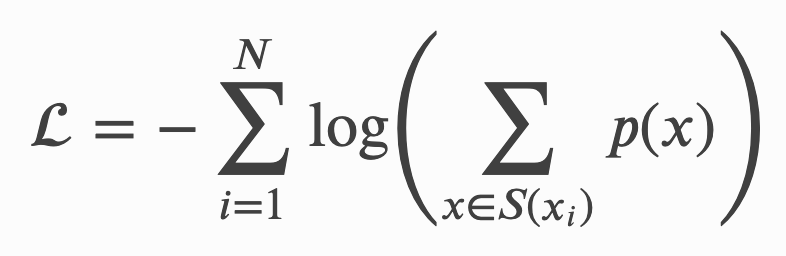

Huggingface Transformers가 버전 3에 접어들며, 문서화에도 더 많은 신경을 쓰고 있습니다. 그리고 이러한 문서화의 일환으로 라이브러리 내에 사용된 토크나이저들의 종류에 대해 간단히 설명을 해주는 좋은 문서가 있어, 번역을 해보았습니다. 최대한 원문을 살려 번역을 하고자 했으며, 원문은 [이곳](https://huggingface.co/transformers/master/tokenizer_summary.html)에서 찾아보실 수 있습니다.


## 토크나이저 살펴보기

이번 포스트에서는 토크나이즈에 대해 알아보는 시간을 가지도록 하겠습니다. 토크나이즈는 입력 문장을 단어 혹은 서브 워드 단위로 쪼갠 후, 사전에 등록된 아이디로 변환해주는 과정입니다.  토큰을 아이디로 변환하는 작업은 매우 직관적이므로, 여기서는 문장을 분절하는 과정에만 집중해보도록 하겠습니다. 더 자세히 이야기하자면, Transformers 라이브러리에서 활용되는 세 가지 핵심 토크나이즈 기법: [Byte-Pair Encoding (BPE)](https://huggingface.co/transformers/master/tokenizer_summary.html#byte-pair-encoding), [WordPiece](https://huggingface.co/transformers/master/tokenizer_summary.html#wordpiece) 그리고 [SentencePiece](https://huggingface.co/transformers/master/tokenizer_summary.html#sentencepiece) 에 대해 알아본 후, 예제와 함께 살펴보겠습니다.


### 토크나이즈란 무엇인가요?

문장을 보다 작은 단위로 쪼개는 것은 생각보다 어려운 작업이며, 이를 위해 여러 가지 방법을 활용할 수 있습니다. 예를 들어, "Don't you love Transoformers? We sure do." 라는 예문을 살펴봅시다. 해당 문장을 쪼개는 가장 간단한 방법은 문장을 공백 단위로 분절하는 것입니다. 이를 통해 아래의 결과를 얻을 수 있게 됩니다.

```python
["Don't", "you", "love", "Transformers?", "We", "sure", "do."]
```

처음치고 나쁘지 않은 결과네요! 그러나 "Transformers?" 나 "do." 와 같은 토큰을 보면, 우리는 개선의 여지가 있다는 것을 확인할 수 있습니다. 해당 토큰들은 구두점을 지니고 있지 않은 "Transformers", "do"와 완전히 다른 토큰으로 인식될 것이기 때문에 우리는 구두점도 분절을 해줄 필요가 있습니다. 구두점도 올바르게 떼어낼 수 있다면 우리는 아래 결과를 얻게 됩니다.

```python
["Don", "'", "t", "you", "love", "Transformers", "?", "We", "sure", "do", "."]
```

훨씬 나아졌군요. 한 가지 여전히 거슬리는 점은 "Don't"이 처리된 방식입니다. "Don't"은 "Do not"을 의미하는 약어입니다. 따라서 이는 `["Do", "n't"]` 와 같이 분절되는 것이 바람직합니다. 이제부터가 토크나이즈가 복잡해지기 시작해지는 시점입니다. 그리고 이러한 복잡함은 여러 모델들이 서로 다른 토크나이저 클래스를 가지고 있는 이유가 되기도 합니다.

문장을 토큰으로 분절할 때 사용하는 규칙에 따라, 우리는 동일한 문장에 대해서도 서로 다른 토큰 리스트를 반환 받을 수 있습니다. 이에 따라 당연하게도 BERT 스타일의 토크나이저로 분절한 토큰을 GPT 모델에 입력 값으로 넣어주게 되면 우리는 원하는 결과를 받아보기 힘들어지겠죠.

[spaCy](https://spacy.io/)와 [Moses](http://www.statmt.org/moses/?n=Development.GetStarted)는 유명한 규칙 기반 토크나이저 라이브러리입니다. 이 두 토크나이저는 우리의 예문을 아래와 같이 분절하게 됩니다.

```python
["Do", "n't", "you", "love", "Transformers", "?", "We", "sure", "do", "."]
```

공백과 구두점을 기반으로 한 토크나이즈와 규칙 기반 토크나이즈는 모두 단어 단위로 문장을 분절하는 예입니다. 단어 단위 토크나이즈는 문장을 분절하는 가장 직관적인 방법이지만, 해당 기법은 코퍼스 크기에 따라 엄청나게 큰 사전을 사용해야 할 수 있다는 단점을 지니게 됩니다. 실제로 [TransformerXL](https://huggingface.co/transformers/master/model_doc/transformerxl.html)은 공백/구두점을 기준으로 분절을 수행하였기 때문에 총 267,735 개의 토큰을 지니는 사전을 활용해야 했습니다!

큰 단어 사전을 활용해야 한다는 말은 큰 사이즈의 임베딩 매트릭스를 활용해야 한다는 말이 되고, 이는 결국 메모리 문제를 야기하게 됩니다. TransformerXL은 Adaptive Embedding 기법을 활용해 해당 문제를 일정 부분 해소하고자 하였지만, 일반적으로 Transformer 기반 모델들은 50,000개 이하의 사이즈를 지니는 사전을 활용합니다. 특히 하나의 언어에 대해 훈련된 모델이라면 더욱이 그래야 겠지요.

단어 단위 토크나이즈가 만족스럽지 않다면, 캐릭터 기반의 토크나이즈를 고려해볼 수도 있습니다. 캐릭터 기반 토크나이즈는 매우 단순하고, 메모리를 엄청나게 절약할 수 있다는 장점이 있지만 이는 모델이 텍스트 표현을 의미있는 단위로 학습하는데 지장을 주게 되고 결과적으로 성능의 감소를 가져오게 됩니다. 따라서 두 세계의 중간에 위치한 서브 워드 단위의 분절을 활용하는 것이 바람직합니다.


### 서브 워드 기반 토크나이즈

서브 워드 기반의 토크나이즈는 "자주 등장한 단어는 그대로 두고, 자주 등장하지 않은 단어는 의미있는 서브 워드 토큰들로 분절한다"라는 원칙에 기반을 둔 알고리즘입니다. 예를 들어, "annoyingly"라는 단어가 코퍼스에서 자주 등장하지 않았던 단어라고 했을 때, 이는 "annoying"과 "ly"로 분절하는게 바람직합니다. 이러한 서브 워드 단위의 분절은 교착어에 있어 특히나 효과적으로 적용될 수 있습니다.

서브 워드 분절은 의미있는 단어 혹은 서브 워드 단위의 표현을 학습하면서도, 합리적인 사전 크기를 유지할 수 있다는 점에 큰 장점을 지닙니다. 또한 서브 워드를 활용한다면 훈련 과정에서 만나지 않은 단어에 대해서도 유의미한 분절을 수행할 수 있게 됩니다. 예를 들어, `BertTokenizer`는 "I have a new GPU!" 라는 문장을 다음과 같이 분절하게 됩니다.

```python
from transformers import BertTokenizer
tokenizer = BertTokenizer.from_pretrained("bert-base-uncased")
tokenizer.tokenize("I have a new GPU!")
>>> ["i", "have", "a", "new", "gp", "##u", "!"]
```

위 예제에서는 uncased 모델을 활용했기 때문에 문장 자체가 소문자로 대체되었습니다. 이후, "gpu"를 제외한 모든 단어들은 단어 단위로 분절이 되었고, "gpu"는 "gp"와 "##u"로 분절이 되었습니다. "##"는 해당 심볼을 지닌 토큰은 해당 토큰 이전에 등장한 토큰과 공백 없이 합쳐져야 한다는 의미입니다.

이번에는 `XLNetTokenizer`를 활용해 처음 활용한 예문을 토크나이즈해보도록 합시다.

```python
from transformers import XLNetTokenizer
tokenizer = XLNetTokenizer.from_pretrained("xlnet-base-cased")
tokenizer.tokenize("Don't you love transformers? We sure do.")
>>> ["▁Don", "'", "t", "▁you", "▁love", "▁", "Transform", "ers", "?", "▁We", "▁sure", "▁do", "."]
```

"▁"의 의미에 대해서는 SentencePiece를 설명할 때 다시 살펴보도록 하겠습니다. 위의 예에서는 "Transformers"가 "Transform"과 "ers"로 분절된 것을 확인할 수 있었습니다.

이제 서로 다른 서브 워드 토크나이즈 알고리즘을 살펴보도록 합시다. 앞으로 살펴볼 모든 알고리즘들은 특정 코퍼스에 대한 훈련이 수행되어야 사용할 수 있습니다.


### Byte-Pair Encoding

Byte-Pair Encoding (이하 BPE)은 [이 논문](https://arxiv.org/abs/1508.07909)에서 처음으로 고안되었습니다. BPE는 일반적으로 훈련 데이터를 단어 단위로 분절하는 Pre-tokenize 과정을 거쳐야 합니다. 이러한 Pre-tokenize는 단순한 공백 단위로 수행될 수 있고, 앞서 언급한 규칙 기반의 토크나이즈를 거쳐 수행될 수 있습니다.

Pre-tokenize를 거친 후, 다음과 같은 단어들을 얻게 되었다고 해봅시다. 여기서 정수 값은 각 단어가 얼마나 등장했는지를 나타내는 값입니다.

```python
('hug', 10), ('pug', 5), ('pun', 12), ('bun', 4), ('hugs', 5)
```

이때 기본 사전은 `['b', 'g', 'h', 'n', 'p', 's', 'u']` 이 되게 됩니다. 기본 사전을 기반으로 위에서 얻어진 단어들을 캐릭터 단위로 쪼개어봅시다.

```python
('h' 'u' 'g', 10), ('p' 'u' 'g', 5), ('p' 'u' 'n', 12), ('b' 'u' 'n', 4), ('h' 'u' 'g' 's', 5)
```

이제 함께 가장 많이 등장한 캐릭터 쌍이 무엇인지 살펴봅니다. "hu"는 총 15번, "ug"는 총 20번이 나와 가장 많이 등장한 쌍은 "ug"가 됩니다. 따라서 "u"와 "g"를 합친 "ug"를 사전에 새로이 추가합니다. 그렇다면 단어 쌍은 아래와 같은 모습을 지니게 됩니다.

```python
('h' 'ug', 10), ('p' 'ug', 5), ('p' 'u' 'n', 12), ('b' 'u' 'n', 4), ('h' 'ug' 's', 5)
```

다음에 가장 많이 나온 쌍은 16번 등장한 "un"이므로, "un"을 사전에 추가해줍니다. 그 다음은 15번 등장한 "hug"이므로 "hug"도 사전에 추가해줍니다.

이 시점에서의 사전은 `['b', 'g', 'h', n', 'p', 's', 'u', 'ug', 'un', 'hug']`가 되게 되고 기존 코퍼스는 아래와 같이 분절됩니다.

```python
('hug', 10), ('p' 'ug', 5), ('p' 'un', 12), ('b' 'un', 4), ('hug' 's', 5)
```

여기서 훈련을 멈추게 되면, 토크나이저는 지금까지 배운 규칙을 가지고 새로운 단어들을 분절하게 됩니다. 예를 들어, "bug"는 `['b', 'ug']`로 분절이 되겠고, "mug"는 "m"이 사전에 등록되어 있지 않으므로 `['<unk>', 'ug']`로 분절이 되게 됩니다. 일반적으로 a-z와 같은 기본 캐릭터들은 기본 사전에 미리 등록되기 때문에 이러한 현상이  "m"에 대해 발생하지는 않겠지만, 이모지와 같은 스페셜 캐릭터들에 대해서는 위 같은 `<unk>` 치환이 많이 발생하게 됩니다.

사전의 크기 (일반적으로 기본 단어 개수 + 합쳐진 서브 워드의 개수) 는 사용자가 정하는 하이퍼파라미터가 입니다. 예를 들어 [GPT](https://huggingface.co/transformers/master/model_doc/gpt.html)의 경우, 478개의 기본 캐릭터에 40,000 개의 서브 워드를 더하도록 설정하였기 때문에 총 40,478의 사전 크기를 지닙니다.


### Byte-level BPE

기본 캐릭터를 모두 지니는 기본 사전을 다루고자 할 때, 사전이 모든 유니코드 캐릭터들을 지니게 하기 위해서는 꽤나 큰 크기로 사전을 지정해야 할 것입니다. 그러나 [GPT-2 논문](https://cdn.openai.com/better-language-models/language_models_are_unsupervised_multitask_learners.pdf)에서는 바이트를 사전의 기본 단위로 사용하는 트릭을 선보였습니다. 이에 구두점을 처리하기 위한 몇 가지 추가 규칙을 더해, Byte-level BPE는 `<unk>`으로의 치환 없이 모든 텍스트를 분절할 수 있게 되었습니다. 따라서 [GPT-2 모델](https://huggingface.co/transformers/master/model_doc/gpt.html)은 256개의 기본 바이트 토큰과 `<end-of-text>` 토큰 그리고 50,000 개의 서브 워드를 더해 총 50,257 개의 토큰 사전을 지니게 되었습니다.


### WordPiece

WordPiece는 [이 논문](https://static.googleusercontent.com/media/research.google.com/ja//pubs/archive/37842.pdf)에서 제안되어, [BERT](https://huggingface.co/transformers/master/model_doc/bert.html)에서 활용된 서브 워드 토크나이즈 알고리즘입니다. 해당 알고리즘은 BPE와 마찬가지로 사전을 코퍼스 내 등장한 캐릭터들로 초기화 한 후, 사용자가 지정한 횟수 만큼 서브 워드를 병합하는 방식으로 훈련됩니다. 한 가지 다른 점이 있다면 WordPiece는 BPE와 같이 가장 많이 등장한 쌍을 병합하는 것이 아니라, 병합되었을 때 코퍼스의 Likelihood를 가장 높이는 쌍을 병합하게 됩니다.

이전 예를 되짚어 봅시다. WordPiece에서는 코퍼스 내에서 "ug"가 등장할 확률을 "u"와 "g"가 각각 등장할 확률을 곱한 값으로 나눈 값이 다른 쌍보다 클 경우 해당 쌍을 병합하게 됩니다. 즉, WordPiece에서는 병합 후보에 오른 쌍을 미리 병합해보고 잃게 되는 것은 무엇인지, 해당 쌍을 병합할 가치가 충분한지 등ㅇㄹ 판단한 후에 병합을 수행한다는 점에 있어 BPE와 다르다고 할 수 있습니다.


### Unigram

Unigram은 [이 논문](https://arxiv.org/pdf/1804.10959.pdf)에서 제시된 서브 워드 토크나이즈 알고리즘입니다. 이는 BPE, WordPiece와 같이 기본 캐릭터에서 서브 워드를 점진적으로 병합해나가는 것이 아니라, 모든 Pre-tokenized 토큰과 서브 워드에서 시작해 점차 사전을 줄여나가는 방식으로 진행됩니다. Unigram은 [SentencePiece](https://huggingface.co/transformers/master/tokenizer_summary.html#sentencepiece)에서 주로 활용이 되는 알고리즘입니다.

더 자세히 이야기해보면, 매 스텝마다 Unigram은 주어진 코퍼스와 현재 사전에 대한 Loss를 측정합니다. 이후, 각각의 서브 워드에 대해 해당 서브 워드가 코퍼스에서 제거되었을 때, Loss가 얼마나 증가하는지를 측정하게 됩니다. 이에 따라 Loss를 가장 조금 증가시키는 p 개 토큰을 제거합니다 (p는 보통 전체 사전 크기의 10-20% 값으로 설정). Unigram은 해당 과정을 사용자가 원하는 사전 크기를 지니게 될 때 까지 반복하게 됩니다. 이때 기본 캐릭터들은 반드시 사전에서 제거되지 않고 유지되어야 합니다.

훈련에 따라 정해진 토큰의 우선 순위대로 토크나이즈를 수행하기에 새로운 단어에 대해 매번 같은 토큰 리스트를 반환하는 BPE, WordPiece와 달리 Unigram은 단어를 분절하는 다양한 방법을 지닐 수 있습니다. 예를 들어, Unigram 훈련을 통해 다음과 같은 사전을 지니게 되었다고 해봅시다.

```python
['b', 'g', 'h', 'n', 'p', 's', 'u', 'ug', 'un', 'hug']
```

이때, "hugs"는 `['hug', 's']`, `['h', 'ug', 's']` 그리고 `['h', 'u', 'g', 's']` 등으로 분절될 수 있습니다. 그렇다면 우리는 어떤 조합을 선택하게 될까요? Unigram은 사전을 구축할 때, 각 토큰의 확률 값들을 함께 저장합니다. 따라서 각 토크나이즈 조합에 대한 확률 값도 계산을 할 수 있게 되므로, 가장 높은 확률을 지니는 토크나이즈 조합을 선택할 수 있게 됩니다. 

이러한 확률은 토크나이저를 훈련시킬 때 사용되는 Loss를 정의하는 값이 됩니다: 만약 코퍼스가 _x^1_, ..., _x^n_ 의 단어로 구성되어 있고, 단어 _x^i_를 토크나이즈 할 수 있는 모든 경우의 수가 _S(x^i)_로 정의 될 때, 우리는 다음과 같이 Loss를 구할 수 있게 됩니다.

|  |
|:-----:|
| Unigram Loss function |


### SentencePiece

지금까지 우리가 살펴본 모든 방법들은 Pre-tokenize 과정을 필요로 하며, 이는 아주 중요한 문제를 야기하게 됩니다: 모든 언어가 공백을 기준으로 단어를 분절할 수 없기 때문이죠. [XLM](https://huggingface.co/transformers/master/model_doc/xlm.html)은 각 언어에 특화된 Pre-tokenizer를 활용하는 방법으로 해당 문제를 풀고자 하였습니다. 그러나 본 문제에 본질적으로 접근한 것은 [이 논문](https://arxiv.org/pdf/1808.06226.pdf)에서 소개된 SentencePiece 입니다. 해당 알고리즘은 입력 문장을 Raw Stream으로 취급해 공백을 포함한 모든 캐릭터를 활용해, BPE 혹은 Unigram을 적용하며 사전을 구축하게 됩니다.

이것이 바로 앞선 `XLNetTokenizer`의 예에서 공백을 나타내는 "▁" 캐릭터를 만나게 된 이유입니다. 해당 스페셜 토큰 덕분에 분절된 텍스트를 디코드하는 작업은 매우 쉬워집니다. 단순히 모든 토큰들을 붙여준 후, "▁" 캐릭터만 공백으로 바꿔주면 되기 때문입니다.

Transformers 라이브러리가 지원하는 모델들 중 SentencePiece를 활용하는 모든 모델들의 토크나이저는 Unigram을 활용해 훈련되었습니다. 이러한 예로는 ALBERT, XLNet 그리고 Marian NMT 프레임워크가 있습니다.
