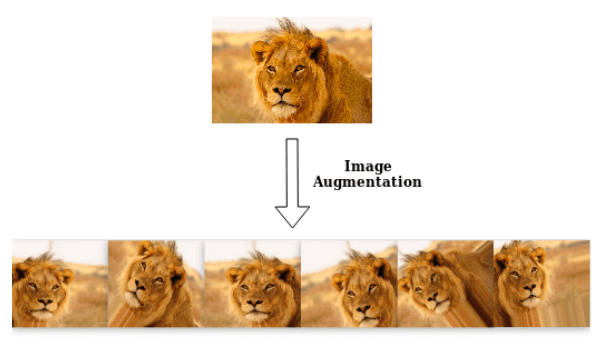

## Contrastive Learning?

최근 Computer Vision 분야에 **Contrastive Learning**을 적용한 다양한 연구 결과가 쏟아져 나오고 있습니다. 이러한 **Contrastive Learning**의 대표적인 연구 성과로는 **Google**의 [SimCLR](https://arxiv.org/abs/2002.05709)와 **FAIR**의 [MoCo](https://arxiv.org/abs/1911.05722) 그리고 **DeepMind**의 [BYOL](https://arxiv.org/abs/2006.07733) 등을 꼽아볼 수 있습니다.

|  |
|:-----:|
| SimCLR 아키텍처 |

**Contrastive Learning**을 나이브하게 이야기하자면, 입력 인스턴스와 **동일한 클래스**를 지니는 인스턴스들을 인코더로 하여금 가까운 Representation을 지니도록 학습하도록 유도하는 기법을 의미합니다. ( 위의 경우 _Self-Supervised Contrastive Learning_ )

**SimCLR**의 예를 보시면 원본 이미지가 되는 가장 좌측의 고양이 이미지에 **Augmentation** 기법을 적용하게 되면 _x_i_, _x_j_ 와 같이, 입력 값은 변하지만 여전히 **동일한 클래스**를 지니는 인스턴스들을 생성할 수 있게 됩니다. 이제 이렇게 얻어진 _x_i_ 와 _x_j_ 의 Representation을 _Embedding Space_ 에서 가까이 위치하도록 학습을 시킵니다. 당연히 다른 클래스에 속하는 인스턴스(이를테면 강아지)는 _Embedding Space_ 상에서 멀어지도록 학습을 시켜주어야 하겠습니다.

|  |
|:-----:|
| Contrastive Learning 이후 시각화 결과 |

이러한 학습 과정을 거치게 되면, 동일한 클래스를 지니는 인스턴스들은 서로 **가까운 공간**에 위치하며 일종의 **클러스터**를 형성하게 됩입니다. 실제로 **Contrastive Learning**을 통해 학습된 모델이 임베딩한 데이터 포인트들의 _t-SNE_ 시각화 [결과](https://arxiv.org/pdf/2005.04966.pdf)를 보게 되면, 동일한 클래스를 지닌 데이터 포인트들은 서로 가까이에 위치하며 일종의 **클러스터**를 형성하는 것을 확인할 수 있습니다.

Computer Vision 분야에서는 이처럼 **Contrastive Learning**을 다양하게 활용해 _Image Classifciation_ 벤치마크에서 좋은 성능을 냄과 동시에 모델로 하여금 좋은 Representation 을 배우도록 유도할 수 있었습니다. 그렇다면 이렇게 좋은 학습 기법을 **자연어 처리** 분야에 적용해본다면 어떨까요?

## Contrastive Learning for Natural Language Processing

(찬물주의) 사실 **Contrastive Learning** 을 자연어 처리에 적용하기란 말처럼 쉬운 것이 아닙니다. **Contrastive Learning**의 기본 전제는 **"동일한 클래스에 속하는 인스턴스는 가까이, 서로 다른 클래스에 속하는 인스턴스는 멀리"** 위치하도록 학습시키는 것입니다.

|  |
|:-----:|
| 이미지를 지지고 볶아도, 웬만하면 클래스를 유지할 수 있는 이미지 |

이미지를 생각해보면 이미지는 _Rotation_, _Shifting_, _Flip_ 등의 **Augmentation** 기법을 적용해도 여전히 동일한 클래스를 지니는 인스턴스를 생성할 수 있습니다. 그러나 자연어 처리에서는 **Augmentation**을 통해 동일한 클래스를 지니는 문장을 대량으로 생성하는데 굉장한 어려움이 따릅니다. **ImageNet**과 같이 _Supervised Contrastive Learning_ 에 활용할 수 있는 대규모 라벨 데이터 역시 부재하고 말이죠.

|  |
|:-----:|
| 토큰 하나만 잘못 바꾸어도 문장 전체의 의미가 바뀌는 문장 |

이처럼 자연어 처리 분야에서는 사전 학습단에 **Contrastive Learning**을 적용하는 것을 기대하기는 쉽지 않습니다. 따라서 울며 겨자먹기로 (?) Fine-tuning 과정에 **Contrastive Learning**을 적용하는 시도가 생기기도 했습니다. 올해 6월 공개된 [CERT](https://arxiv.org/abs/2005.12766)에서는 **BERT** 스타일의 **MLM**을 활용한 사전 학습 이후, 타겟 태스크에 대해 **Fine-tuning**을 바로 적용하지 않습니다. 대신 타겟 태스크의 훈련 인스턴스 문장들을 모두 추출합니다.

|  |
|:-----:|
| CERT가 차용한 Back-Translation |

이제 추출된 문장에 서로 다른 _back-translation_ 을 적용해 두 개의 _augmented sentences_ (x', x'') 를 구해놓습니다. 그리고 이렇게 증강된 문장들이 **같은 문장** (x) 을 기반으로 증강된 것이라면 _positive pair_ 가 그렇지 않으면, _negative pair_ 로 설정을 하게 됩니다. 이후 _positive pair_ 로 설정된 증강 데이터들은 가까이 _negative pair_ 로 설정된 증강 데이터들은 멀리 위치하도록 학습을 시키게 됩니다. 그리고 이 과정 이후 최종적으로 _label_ 을 활용해 태스크를 (우리가 아는 일반적인 방식으로) 풀도록 합니다. **CERT**에서는 이 과정을 통해 아키텍처의 변경 없이, **GLUE** 벤치마크에서 (약간의) 성능 향상을 얻을 수 있었습니다.

|  |
|:-----:|
| CERT 의 훈련 파이프라인 |

이처럼 자연어 처리 분야에서의 **Contrastive Learning**은 아직까지 **Fine-tuning** 단에서 활용되는 수준에 그치고 있습니다. 그렇다면 약간의 성능 향상을 위해 **Fine-tuning**에서 **Contrastive Learning**을 번거롭게 해야할 이유가 있을까요? **Contrastive Learning**을 적용하면 그외에 어떠한 이점을 기대할 수 있을까요?

## Supervised Contrastive Learning for Pre-trained Language Model Fine-tuning

**ICLR 2021** OpenReview에 등록된 **Supervised Contrastive Learning for Pre-trained Language Model Fine-tuning** 은 **CERT**와 마찬가지로 **Fine-tuning** 단에 **Contrastive Learning**을 적용한 실험 결과를 공유한 논문입니다. 저자진이 공개된 현재 본 논문은 **Stanford**와 **FAIR**의 공동 연구인 것으로 확인되었습니다.

본 논문에서는 **Contrastive Learning**을 **Cross-entropy Loss** 의 한계를 보완해주는 도구로 해석하였습니다. 이 글을 읽고 계신 많은 분들은 이미 아시는 내용이겠지만 **Cross-entropy Loss** 는 여러 한계를 지니고 있습니다. 그리고 이러한 한계들로 인해 학습 시 **모델의 일반화**를 방해하게 되고, 때로는 **불안정**한 학습을 야기하기도 합니다.

**Cross-entropy Loss**는 클래스의 중심이 되는 Classifier 내 _i-th vector_ 와 훈련 인스턴스 간 손실 값을 모두 공평하게 계산하므로, 최종적으로 _Margin_이 좋지 않게 형성될 수 있다는 문제를 지니고 있습니다. 그리고 이를 **Cross-entropy Loss**의 _Poor margin_ 문제라고 일컫습니다. 이러한 문제 때문에 **Cross-entropy**에만 의존해 학습을 한 모델은 **노이즈가 낀 데이터**, **적대적으로 생성된 데이터**에 대해 강건하지 못한 추론을 하게 되는 것입니다.

|  |
|:-----:|
| Margin을 임의로 부여했을 때, 클래스 중심 간 구분이 더 잘 되는 모습을 보여줌 |

이러한 문제를 보완하기 위해 **훈련 인스턴스와 클래스 중심 간 유사도**를 계산할 때 _Margin_ 을 부여해 더 엄격한 훈련을 시키는 [Margin Loss](https://arxiv.org/abs/1612.02295)가 제안되었으며,  _label smoothing_, _Mixup_, _CutMix_ 등의 **정규화** 기법 역시 Classifier의 보다 강건한 학습을 위해 고안되었습니다.

최근 **Cross-entropy Loss**만을 활용하여 **Fine-tuned** 된 **자연어 모델** 역시 불안정한 모습을 보인다는 관측이 많이 보고되었고, 이러한 현상은 특히 훈련 데이터가 제한된 상황에서 더 도드라지게 나타난다고 합니다. 그리고 저자진은 이러한 불안정한 학습을 **Contrastive Learning**을 통해 해결하고자 하였습니다.

제한된 사례만을 보고 학습을 해야할 때 우리는 어떤 방식으로 학습을 할까요? 먼저, 동일하게 분류되어야 할 것들 간에는 **유사한 점**을 파악할테고, 다르게 분류되어야 하는 것들 간에는 **서로 다른 점**을 파악하고자 할 것입니다. 저자들은 모델도 우리와 마찬가지 방식으로 학습을 할 수 있다고 생각했습니다. 따라서 단순히 **Cross-entropy Loss** 만을 활용해 **클래스의 기준점과 인스턴스 벡터를 가깝게 학습**시키는 것 뿐만 아니라, 모델에게 **인스턴스 간 비교**를 하게끔 하였습니다.

이제 본격적으로 논문을 살펴보도록 하겠습니다.

### Approach

|  |
|:-----:|
| Supervised Contrastive Learning의 Loss function |

말은 거창했지만, 글의 흐름을 잘 따라오신 분들이라면 저자진이 고안한 훈련 방안이 새로운 것이 아니라는 것은 눈치 채셨을 것입니다. 단순히 **Cross-entropy Loss**와 **Supervised Contrastive Learning**을 **Fine-tuning** 단에 섞어 활용을 하겠다는 것지요. (1) 식을 보시면 **Cross-entropy**로 발생하는 _Loss_ 를 `(1 - lambda)` 만큼, **Contrastive Learning**으로서 발생하는 _Loss_ 를 `lambda` 만큼 학습에 활용합니다. (여기서 `lambda`는 태스크 별로 다르게 적용 가능한 하이퍼 파라미터입니다.)

다음으로 (3)의 **Contrastive Learning Loss**를 보게 되면 N 개 배치에서 Row와 Column을 각각 돌며 (i, i) 번째 인스턴스와 동일한 클래스의 인스턴스들은 (i, i) 인스턴스와 가까워지도록, 그렇지 않은 인스턴스들은 (i, i) 번째 인스턴스와 멀어지도록 학습을 시켜야 Loss가 감소하게 됩니다. 여기서 `tau` 는 클래스 간 분할을 얼마나 더 엄격하게 시킬지를 결정하는 하이퍼 파라미터입니다. 일반적으로 큰 값의 `tau`는 클래스 간 분할이 보다 쉽게 이루어질 수 있도록 도와줍니다. 그리고 작은 값의 `tau`는 일종의 Hard Positive / Negative 를 형성해 학습을 보다 어렵게 하지만, 강건한 분류기를 기대할 수도록 도와주게 됩니다. ([참조](https://arxiv.org/pdf/2004.11362.pdf))

|  |
|:-----:|
| Supervised Contrastive Learning Loss function |

논문에서는 **BERT** 원 논문을 따라 `[CLS]` 토큰을 **문장을 대표하는 임베딩**으로 간주하여, **Constrastive Learning**을 진행합니다. 위 예제 그림이 앞서 설명한 **Cross-entropy**의 한계와, 이를 보완하는 **Contrastive Learning**의 효과를 잘 보여주고 있는데 **Cross-entropy Loss**만을 가지고 학습된 Representation들은 클래스 간 _Margin_ 이 굉장히 **가깝게 형성**되어 불안정한 모습을 보이게 되지만, **Constrastive Learning**이 함께 적용된 경우 클래스 간 분리가 굉장히 잘 되어있는 것을 확인 할 수 있습니다.

### Experimental Setup

|  |
|:-----:|
| GLUE 실험 결과 |

저자진은 **GLUE** 벤치마크 중 **Single Sentence Classification** 및 **Sentence-pair Classification**을 수행할 수 있는 6개 태스크를 선정하였습니다. 그리고 **Contrastive Learning**이 **노이즈가 많은 환경에서 강건**하다는 것을 실험을 통해 보이기 위해 _back-translation_ 을 활용해 노이즈 데이터를 증강시킨 실험 환경도 준비해두었습니다.

|  |
|:-----:|
| Temperature 적용한 데이터 증강 예시 |

이때 데이터 증강의 목적은 **질 좋은** 훈련 데이터를 늘리는 것이 아닌, **노이즈가 낀** 훈련 데이터를 늘리는 것이기 때문에 _beam search_ 를 거쳐 **이쁘게** _back-translated_ 된 문장이 아닌 _temperature scailing + random sampling_ 을 거쳐 **다양하게** 문장을 생성하도록 하였습니다. 실제로 위 표를 보시면 _temperature_ 을 크게 설정할수록 원문에서 보다 벗어난 문장이 생성되는 것을 확인하실 수 있습니다.

### Analysis and Results

|  |
|:-----:|
| 성능표 |

논문에서는 `RoBERTa-Large` 모델을 실험의 _baseline_ 으로 상정하였습니다. 그리고 위 표를 보시면 6개 태스크 중, 5개 태스크에서 **Contrastive Learning**을 추가 수행한 모델이 더 좋은 성능을 보인 것을 확인할 수 있습니다. 그렇다면 **MNLI** 에서는 왜 성능 향상이 이루어지지 않았을까요?

**2개** 라벨을 지니는 5개 태스크와 달리 **MNLI**는 **3개** (entail, neutral, contradict) 의 라벨을 지니는 태스크입니다. 그리고 이는 **한 배치 내 동일한 클래스에 속하는 인스턴스의 개수**가 다른 태스크들보다 적다는 것을 의미합니다. 즉, 배치 단위로 학습이 이루어질 때 _positive pair_ 를 상대적으로 더 적게 보기 때문에 다른 태스크들보다 **Contrastive Learning**의 효과를 덜 받게 된다는 이야기입니다. 실제로 아래 표를 보시면 **배치 사이즈가 클수록 태스크의 너른 성능 향상**을 기대할 수 있습니다. 그리고 이는 **Contrastive Learning**이 배치 사이즈에 영향을 크게 받는다는 선행 연구들과도 일치하는 결과입니다.

혹시 위 표를 보시고 **"추가적인 Loss term을 활용한 것 치고 성능 향상이 도드라지게 나타나는 것 같지는 않네..."** 라는 생각을 하셨나요? 좋은 의문을 제기해주셨습니다. 사실 본 논문에서 **Fine-tuning** 단에 적용한 **Contrastive Learning**은 일반적인 성능 향상에도 의미가 있지만, _Robustness_ 가 강조되어야하는 환경, **Few-shot** 그리고 **Noisy** 한 세팅에서 보다 큰 의미가 있습니다.

|  |
|:-----:|
| Few-shot 세팅에서의 Supervised Contrastive Learning |

**Few-shot** 세팅의 실험 결과는 위 표와 같습니다. 각각 `20`, `100`, `1000` 개의 훈련 인스턴스만 가지고 모델을 학습시킨 결과, **Contrastive Learning**이 함께 적용된 모델이 보다 좋은 성능을 기록한 것을 확인하실 수 있습니다. 해당 성능 차이는 훈련 인스턴스의 개수가 늘어남에 따라 줄어들게 되지만, `N=20` 과 같은 환경을 상정하면 확연히 **Contrastive Learning**의 이점이 있다는 것을 확인할 수 있습니다.

|  |
|:-----:|
| 임베딩 시각화 결과 |

이러한 이점을 더 극명하게 보여주는 것이 위 그림입니다. `N=20` 환경에서 **SST-2** 데이터셋에 대해 학습된 모델들로 하여금 테스트 인스턴스들의 Representation을 **t-SNE**로 시각화시켜본 결과, **Contrastive Learning**을 적용한 모델이 클래스 간 **훨씬 더 컴팩트한 클러스터**를 구성하고 있음을 확인할 수 있습니다.

|  |
|:-----:|
| Noisy Dataset 성능표 |

이제 앞서 데이터 증강 ( via. _back-translation_ )을 통해 **노이즈**한 훈련 데이터셋을 구성한 후, 모델을 학습한 결과를 확인해보도록 합시다. 위 표를 보시면 대부분의 경우, **Contrastive Learning**을 추가로 적용하였을 때 **노이지**한 환경에서 더 좋은 성능을 보였습니다. 특히 **NLI** 태스크들에서 일반적인 **Cross-entropy**만 적용해 학습한 모델과 비교했을 때 더 강건한 성능을 보였다는 것에 주목해 볼 필요가 있습니다.

앞서 언급했듯, _temperature scailing + random sampling_ 을 통해 증강된 데이터들은 보다 **다양하게 생성**이 되기 때문에 필연적으로 **문법적 오류** 혹은 **사실 관계 오류**를 낼 가능성이 (_beam search_ 를 통해 생성된 문장에 비해) 높아지게 됩니다. 따라서 **Cross-entropy Loss**만 적용한 모델의 경우 _temperature_ 가 올라갈 때 마다 추론 태스크에 대해 급격한 성능 하락을 보이게 되지만, **Contrastive Learning**이 추가로 적용된 모델은 이러한 **노이즈**에 조금이나마 더 강건한 모습을 보이는 것을 확인할 수 있습니다.

|  |
|:-----:|
| Out-of-Domain 성능표 |

뿐만 아니라 **SST-2**에 대해 **Fine-tuned** 된 모델을 같은 **Single Sentence Classification** 태스크이지만, **도메인이 전혀 다른** _Amazon_ 및 _Yelp_ **Sentiment Classification** 에 대해 **Few-shot Learning**을 시켜보았을 때, **Contrastive Learning**을 추가로 적용한 모델이 더 좋은 성능을 기록한다는 것을 확인할 수 있습니다. 이뿐만 아니라 **서로 다른 하이퍼 파라미터로 학습된 모델들** 간 성능 _variance_ 에서도 안정적인 모습을 보이며 **Domain 간 간극**에서도 강건한 모습을 보여주었습니다.

### Conclusion

본 논문은 새로운 학습 패러다임을 제시했다거나, 아키텍처적 개선을 이끌었다는 등 특별한 _novelty_ 를 보여준 논문은 아닙니다. 그럼에도 최근 Computer Vision을 비롯한 여러 도메인에서 많은 연구자들의 관심을 끌고 있는 **Contrastive Learning**이 자연어 처리 도메인에서는 어떻게 적용될 수 있는지, 그리고 해당 기법이 어떤 문제를 _tackle_ 할 수 있는지를 실험을 통해 보여준 논문이라고 할 수 있습니다.

특히 **Contrastive Learning**을 **Fine-tuning** 단에 적용하면 어떠한 환경에서 이점을 가질 수 있는지를 다각도로 잘 보여준 논문이라고 생각합니다. 논문에서 제시한 **Few-shot**, **Noisy**, **Out-of-Domain**의 세팅 외에도 **Semantic Similarity** 가 강조되어야 하는 태스크, 이를테면 _QQP_, _STS_ 등의 학습에 있어서도 좋은 기여를 할 수 있을 것이라는 생각이 드네요.

또한 개인적으로 **Contrastive Learning** 관련 논문을 하나 정리하며, 패러다임의 흐름을 얕게나마 이해하고 싶다는 생각을 하고 있었는데 때마침 유익한 논문이 나와 재미있게 학습할 수 있었던 것 같습니다. **ICLR** [Open Reivew](https://openreview.net/forum?id=cu7IUiOhujH)에서도 뜨뜨미지근한 리뷰를 받은 것 같은데, 모쪼록 좋은 결과가 있었으면 좋겠네요 :) 

## References

- [Supervised Contrastive Learning for Pre-trained Language Model Fine-tuning](https://arxiv.org/abs/2011.01403)
- [Large-Margin Softmax Loss for Convolutional Neural Networks](https://arxiv.org/abs/1612.02295)
- [Supervised Contrastive Learning](https://arxiv.org/pdf/2004.11362.pdf)
- [CERT: Contrastive Self-supervised Learning for Language Understanding](https://arxiv.org/abs/2005.12766)
- [메트릭러닝 기반 안경 검색 서비스 개발기(2)](https://blog.est.ai/2020/02/%EB%A9%94%ED%8A%B8%EB%A6%AD%EB%9F%AC%EB%8B%9D-%EA%B8%B0%EB%B0%98-%EC%95%88%EA%B2%BD-%EA%B2%80%EC%83%89-%EC%84%9C%EB%B9%84%EC%8A%A4-%EA%B0%9C%EB%B0%9C%EA%B8%B02/)