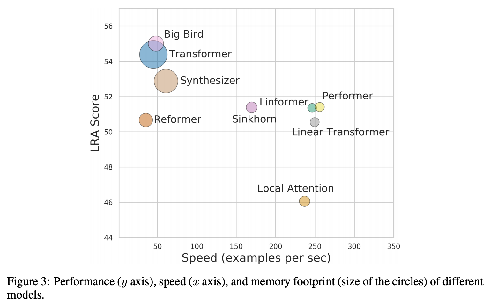

이 글은 **DeepMind** 소속의 **Sebastian Ruder**가 매년 블로그를 통해 발행하는 **ML and NLP Research Highlights** 의 [2020년](https://ruder.io/research-highlights-2020/) 버전 중 **자연어 처리**와 관련된 이야기만 번역한 포스트입니다. 작년 한 해 동안 **자연어 처리** 분야에 어떠한 발전이 있었고, 글을 읽는 스스로가 해당 발전을 얼마나 잘 캐치업 해있는지를 점검하기 좋은 글이라고 생각되어 공유합니다. 의역이 많으니, 참고하고 봐주시면 감사하겠습니다 😃

## Scailing up - and down

|  |
|:-----:|
|2018-2020년 언어 모델 크기 변화 추이 |

### What happened ?

2020년은 [Meena](https://arxiv.org/abs/2001.09977), [Turing-NLG](https://www.microsoft.com/en-us/research/blog/turing-nlg-a-17-billion-parameter-language-model-by-microsoft/), [Blender](https://arxiv.org/abs/2004.13637) 그리고 [GPT-3](https://proceedings.neurips.cc/paper/2020/file/1457c0d6bfcb4967418bfb8ac142f64a-Paper.pdf) 까지, 이전까지 볼 수 없었던 크기의 언어 & 대화 모델이 등장한 한 해였습니다. 동시에 이처럼 거대한 모델을 훈련시킨다는 것이 얼마나 돈이 많이 들고, 많은 에너지를 필요로 하는 실험인지에 대해 연구자들이 더 잘 [인지](https://www.aclweb.org/anthology/P19-1355/)하게 된 해이기도 합니다. 때문에 거대한 언어 모델을 경량화하려는 연구들이 다양한 방향으로 발전을 하고 있죠. 최근에는 많은 연구들이 [Pruning](https://papers.nips.cc/paper/2020/file/eae15aabaa768ae4a5993a8a4f4fa6e4-Paper.pdf), [Quantization](https://openreview.net/forum?id=dV19Yyi1fS3), [Distillation](https://arxiv.org/abs/1910.01108) 그리고 [Compression](https://www.aclweb.org/anthology/2020.emnlp-main.633/) 등의 기법을 발전시키는 방향으로 흘러가고 있습니다. 또 다른 접근법으로는 Transformer 아키텍처 자체를 보다 효율적으로 만드는 방향이 있겠습니다. 이러한 방향에는 [Performer](https://openreview.net/forum?id=Ua6zuk0WRH), [Big Bird](https://papers.nips.cc/paper/2020/file/c8512d142a2d849725f31a9a7a361ab9-Paper.pdf)와 같은 아키텍처 연구들이 존재합니다.

|  |
|:-----:|
|[Long Range Arena](https://openreview.net/pdf?id=qVyeW-grC2k) |

추가로 [`experiment-impact-tracker`](https://arxiv.org/abs/2002.05651)와 같은 도구들은 모델의 에너지 효율성을 보다 쉽게 추적할 수 있도록 도와주고 있습니다. 또한 최근에는 [SustaiNLP](https://sites.google.com/view/sustainlp2020/home?utm_campaign=NLP%20News&utm_medium=email&utm_source=Revue%20newsletter), [EfficientQA](https://ai.google.com/research/NaturalQuestions/efficientqa?utm_campaign=NLP%20News&utm_medium=email&utm_source=Revue%20newsletter)와 같이 **효율성**에 집중을 한 워크샵들도 등장하며 다양한 Competition과 벤치마크의 설립을 장려하고 있습니다.

### Why is it important ?

모델의 스케일을 키운다는 것은 모델이 할 수 있는 영역을 확장시켜나갈 수 있다는 의미입니다. 그러나 이러한 거대 모델들을 현실 세계 문제에 사용하고 배포하기 위해서 모델은 보다 **효율적으로 개선**될 필요가 있습니다. 궁극적으로 다음의 두 연구 방향이 서로에게 이득을 주는 구조가 될 수 있겠습니다. [Train Large, Then Compress](https://arxiv.org/abs/2002.11794) 와 같이 거대 모델을 잘 Compress 하여 좋은 성능을 낼 수 있는 효율적인 모델들을 얻거나, [ELECTRA](https://arxiv.org/abs/2003.10555) 와 같이 보다 좋은 성능의 모델을 만들 수 있는 효율적인 훈련 방법론을 연구하거나 !

### What's next?

저는 에너지 효율성에 쏟아지고 있는 많은 관심과 이를 장려할 수 있는 도구들의 등장으로 인해, 모델의 성능 뿐만 아니라 **파라미터 수**와 이를 학습시키는데 필요한 **에너지 효율성**을 함께 보고하는 문화가 보다 당연해질 것이라 생각합니다. 이러한 전체적인 평가를 통해 **Real-World ML 적용 사례**와 **연구**의 간극이 많이 좁혀질 것입니다.

## Retrieval Augmentation

|  |
|:-----:|
|Encoder와 Retriever가 함께 훈련되는 REALM |

### What happened ?

거대 언어 모델들은 사전 학습 과정을 통해, 세상에 존재하는 많은 지식을 학습할 수 있다는 것을 여러 결과를 통해 보여주었습니다. 외부 맥락 없이도 질문에 [답을 하는 모습](https://www.aclweb.org/anthology/2020.emnlp-main.437.pdf)을 보여주는가 하면, 사실 관계를 [재현하는 능력](https://www.aclweb.org/anthology/2020.tacl-1.28.pdf)을 보여주는 식으로 말이죠. 그러나 이처럼 지식을 모델 파라미터를 통해 **Implicit하게 저장**하는 것은 비효율적이이며, 지식을 더 많이 축적하기 위해서는 보다 점점 더 큰 모델 (Parameter)을 필요로 하게 된다는 단점이 있습니다.

최근에는 [REALM](https://arxiv.org/abs/2002.08909), [RAG](https://arxiv.org/abs/2005.11401), [knn-LM](https://openreview.net/forum?id=HklBjCEKvH) 등과 같이 **Retrieval 모듈**과 **언어 모델**을 함께 학습시켜 `Open-domain QA`, `언어 모델링` 등의 **Knowledge-intensive** 태스크에서 좋은 결과를 얻을 수 있다고 주장하는 연구들이 많이 등장하고 있습니다. 해당 접근의 장점은 언어 모델 사전 학습 과정에 **Retrieval 모듈**을 레버리지하기 때문에 언어 모델을 보다 효율적으로 학습시킬 수 있다는 것입니다. 언어 모델은 지식을 기억하는 짐을 덜고, **자연어 이해**에 보다 집중을 하는 방식으로 학습을 진행하면 되기 때문이겠죠. 이러한 흐름 속에 진행된 **EfficientQA** 대회에서 좋은 결과를 얻었던 모델들을 살펴보니, 해당 모델들은 모두 **Retrieval 모듈**에 의존을 하고 있었습니다.

### Why is it important ?

과거 Retrieval은 텍스트 요약 혹은 대화 모델 등 다양한 생성 태스크에 있어 필수적인 요소였습니다. **Retrieval-augmented Generation**은 Retrieved 된 문맥을 활용하기 때문에 **Factual Correctness**와 **신뢰성**이라는 두 마리 토끼를 모두 잡을 수 있다는 장점이 있습니다. 뿐만 아니라 토픽과 밀접한 문장을 생성할 수 있다는데에도 이점이 있습니다.

### What's next ?

**Retrieval-augmented Generation**은 생성 모델이 고질적으로 가지고 있는 할루시네이션 (i.e., producing irrelevant or contradicted facts) 문제 해소에 많은 도움을 줄 수 있을 것으로 보입니다. 또한 모델이 **예측한 혹은 생성한 결과**의 근거가 될 수 있는 레퍼런스를 제공할 수 있게됨으로써 보다 **해석 가능한 판단**을 내릴 수 있다는데에도 큰 장점이 있습니다.

## Few-shot Learning

|  |
|:-----:|
|Template Prompt를 활용한 Fine-tuning |

### What happened ?

최근 몇 년간 진행된 사전 학습의 발전 덕분에, 특정 태스크를 수행하기 위해 필요한 훈련 데이터의 수는 획기적으로 줄었습니다. 그리고 이제는 단 수 십개의 훈련 데이터만으로 **태스크를 모델에게 설명 (demonstartion)**할 수 있다고 주장하는 [연구](https://www.aclweb.org/anthology/2020.emnlp-main.38.pdf)들도 등장하고 있습니다.  이처럼 **Few-shot Learning** 에서 가장 자연스럽다고 여겨질 수 있는 패러다임은 **태스크 자체를 언어 모델로 재구성**하는 것입니다.

이러한 패러다임에서 가장 유망한 연구가 **GPT-3**의 **In-Context learning**이며, GPT-3는 실제로 **입력 값**과 **기대되는 출력 값**으로 구성된 **몇 개의 예제**들을 기반으로 **모델 가중치 업데이트** 없이 예측을 수행합니다. 그러나 이러한 세팅은 몇 가지 문제를 지니고 있는데, 이는 모델이 파라미터에 지니고 있는 지식을 기반으로 예측을 수행하게 되기 때문에 **반드시 거대한 모델을 활용**해야 하며, 모델이 예측을 하는데 활용할 수 있는 예제가 **최대 입력 길이에 따라 제한적**이며, 예제라고 불리우는 **Prompt가 사람에 의해서 조정**되어야 한다는 점입니다.

최근에는 보다 [작은 모델을 활용한다던가](https://arxiv.org/abs/2009.07118), [Fine-tuning 과정을 혼합한다던가](https://arxiv.org/abs/2012.15723), [자연어 Prompt를 자동으로 생성한다던가](https://arxiv.org/abs/2010.15980) 등 **Few-shot Learning**을 위한 다양한 방향성의 연구들이 수행되고 있습니다. 그리고 이러한 연구들은 넓게 보자면, 사전 학습된 **생성 모델의 생성 능력을 레버리지**하는 [Controllable Text Generation](https://lilianweng.github.io/lil-log/2021/01/02/controllable-neural-text-generation.html)과 맞닿아 있기도 합니다.

**Few-shot Learning**은 모델로 하여금 많은 태스크를, 보다 빠르게 풀 수 있게 도와줄 수 있습니다. 그러나 모든 태스크의 수행을 위해 모델의 파라미터를 각각 업데이트하는 것은 전혀 효율적이지 않습니다. 대신 **부분적인 파라미터만 조정하는 전략**을 취하는 것이 훨씬 더 바람직할 수 있습니다. 이를 위해 [Adapter](http://proceedings.mlr.press/v97/houlsby19a/houlsby19a.pdf)개념을 통해 **Fine-tuning**을 보다 실용적이고, 효율적으로 진행할 수 있다는 연구들도 등장하고 있는가 하면, [Sparse Parameter Vector](https://arxiv.org/abs/2012.07463)를 활용하는 연구, 모델 가중치 중 태스크 별로 [`bias` 값만 조정](https://nlp.biu.ac.il/~yogo/bitfit.pdf)하는 연구 등도 등장하고 있습니다.

### Why is it important ?

모델에게 단 몇 가지 예제만을 통해 태스크를 학습시킬 수 있게 된다는 것은, ML/NLP 모델을 활용하는데 있어 존재하는 여러 장벽들을 제거해줄 수 있다는 것을 의미합니다. 미래에는 **Few-shot Learning**을 통해 학습 데이터를 구하기 매우 어려운 환경에서 어플리케이션을 개발하거나, 기학습된 모델을 새로운 도메인에 적용하는 등의 작업을 보다 손쉽게 해결할 수 있게 될 것입니다.

### What's next ?

사실 실생활에서 수 천개의 훈련 데이터셋을 **쉽게** 구할 수 있는 경우도 많습니다. 따라서 **Few-shot Learning** 모델은 아주 작은 데이터로도 학습을 진행할 수 있어야 하지만, 수 천개의 데이터가 주어졌을 때 **Seamless하게 스케일 업**을 할 수도 있어야 할 것입니다. 또한 입력 길이의 제한으로 인해 컨텍스트가 제한되는 문제도 해결되어야 합니다. 마지막으로 [SuperGLUE](https://super.gluebenchmark.com/leaderboard)와 같은 여러 유명 벤치마크에서 최근의 언어 모델들이 훈련 데이터에 대해 **Fully Fine-tuned** 되었을 때 인간의 성능을 뛰어 넘을 수 있음을 보여주었으므로, **Few-shot Learning** 세팅에서도 성능 개선 여깃 함께 꾀해야함은 당연한 숙제입니다.

## Evaluation beyond accuracy

|  |
|:-----:|
|CheckList |

### What happened ?

최근 여러 언어 모델들이 다양한 태스크에서 **인간의 성능**을 뛰어넘는 모습을 보여주고 있습니다. 해당 모델들이 실제로 자연어를 이해하고 있다고 믿던 [믿지 않던](https://www.aclweb.org/anthology/2020.acl-main.463/), 우리 모두는 현재 모델들이 **"인간의 언어를 완전히 이해한다"**는 목표에 도달했다고 생각하지는 않습니다. 그러나 **현존하는 메트릭**들은 모델들의 한계점을 파악하는데 여러 어려움을 겪고 있습니다. 여기서 두 가지 연구 주제가 등장할 수 있습니다. 첫 번째는 **현재의 모델들이 풀기 어려운, 아주 어려운 예제를 큐레이팅하는 것**이고, 두 번째는 `accuracy`와 같은 간단한 메트릭을 넘어 보다 **Fine-grained 한 평가 방안**을 고안하는 것입니다.

전자의 주제에서 흔하게 등장하는 방법론은 데이터셋을 생성하는 과정에서 현재 모델들이 잘 풀 수 있는 예제들을 미리 제거하는 [Adversarial Filtering](https://www.aclweb.org/anthology/D18-1009/) 입니다. 최근 이러한 예제들을 보다 효율적으로 **Filtering** 시킬 수 있는 다양한 기법들이 소개되고 있으며, 예제를 **Filtering** 하고 모델을 **Filtered-out 데이터에 대해 훈련시**키고, 다시 예제를 **Filtering** 하고 **2차 Filtered-out 데이터에 재훈련**시키는 등 여러 라운드를 거쳐 데이터셋을 생성하는 **Iterative Dataset Creation** 같은 연구도 등장하고 있습니다. 이처럼 진화하는 벤치마크의 예는 [Dynabench](https://dynabench.org/)에서 확인해볼 수 있습니다.

후자의 주제에 있어 데이터는 특정 태스크를 위해 생성되어야 하는 대상이 아니라, 모델이 태스크를 수행함에 있어 발생하는 **여러 현상들을 분석하기 위해 사용될 수 있는 도구**입니다. 그리고 이를 위해 주로 **Gold Label을 바꾼다던지**, **입력 값에 약간의 수정**을 가하는 등 **Perturb**를 부여한 `Counterfactual` 혹은 `Contrast Set`을 만드는 연구가 많이 진행되어 왔습니다. ACL 2020에서 Best Paper Award를 수상한 [CheckList](https://www.aclweb.org/anthology/2020.acl-main.442/)에서는 모델의 추론 결과에 대해 직관적인 판단을 내릴 수 있는 **테스트 케이스를 공식화**기도 하였습니다.

### Why is it important ?

보다 좋은 언어 모델을 만들기 위해 우리는 단순히 현재 모델들이 이전 모델들보다 좋은 성능을 보였느냐만 볼 것이 아니라, 모델이 **어떠한 오류**를 내고, **어떠한 특징 이해하는데 어려움을 겪는지** 등을 직접 파악하고 이해할 필요가 있습니다.

### What's next ?

모델의 추론 결과에 대해 보다 **Fine-grained 한 평가**를 내릴 수 있게 된다면, **모델이 지닌 결함**과 해당 결함을 해소하기 위해 나아가야 할 연구 방향을 식별하는데 많은 도움을 얻을 수 있게 될 것입니다. 또한 이러한 평가는 **서로 다른 기법, 모델의 장단점**에 대해 보다 뚜렷한 비교와 판단을 수행할 수 있도록 도와줄 수도 있습니다.

## Practical concerns of Large LMs

|  |
|:-----:|
|유해하지 않은 Prompt로 부터 Toxic Content를 생성하는 언어 모델들 |

### What happened ?

언어 모델이 학습할 수 있는 **Syntactic**, **Semantic** 그리고 **World Knowledge** 정보에 집중적인 분석 연구가 수행되었던 작년 (2019)과 달리 최근에는 모델이 지닐 수 있는 여러 실용적인 우려를 파헤치고, 분석하려는 시도들이 많아지고 있습니다. 이러한 연구 흐름 속에서 사전 학습된 언어 모델들은 [Toxic한 언어를 생성](https://www.aclweb.org/anthology/2020.findings-emnlp.301/)하는 문제에 있어 매우 취약하다는 사실이 확인되었으며, [학습 데이터가 유출](https://arxiv.org/abs/2004.00053)될 수 있다는 문제도 제기되고 있습니다. 또한 [공격자가 모델의 예측을 조정](https://www.aclweb.org/anthology/2020.acl-main.249/)해 **Backdoor Attack**을 수행할 수 있다는 지적, [모델](https://openreview.net/forum?id=Byl5NREFDr)과 [데이터 추출](https://arxiv.org/abs/2012.07805) 공격 등에 대한 이야기도 나오고 있습니다. 사전 학습된 모델들이 [Gender bias](https://arxiv.org/abs/2010.06032)를 지닐 수 있다는 것은 널리 알려진 사실이고 말이죠.

### Why is it important ?

거대 사전 학습 모델은 여러 기관에서 학습되고, 실제로 현실 세계에서 널리 사용되고 있습니다. 때문에 모델들이 **bias**를 지닐 수 있음을 인지하고 있을 뿐만 아니라, 모델의 어떠한 행위가 **사회에 해로운 결과를 미칠 수 있는지**에 대한 이해를 하는 것은 실용적으로 중요합니다.

### What's next ?

더 크고, 더 강한 모델들이 연구/개발됨에 따라 모델이 학습할 수 있는 **편향**, **공정성**과 같은 현실적 우려들을 초기 연구/개발 과정부터 고민하는 것은 점점 더 중요해질 것입니다.

## Multilinguality

|  |
|:-----:|
|언어별 데이터의 불균형 분포 |

### What happened ?

2020년은 **Multilingual NLP**에 있어 많은 진보가 있었습니다. **아프리카 언어**를 위한 자연어 처리 기술을 증진시키겠다는 미션을 지닌 [Masakhane](https://www.masakhane.io/)가 **WMT20**에서 발제한 [키노트](https://www.youtube.com/watch?v=Xbc_g_OknqA)는 작년 최고의 발표 중 하나였습니다. 또한 작년은 [XTREAM](http://proceedings.mlr.press/v119/hu20b/hu20b.pdf), [XGLUE](https://www.aclweb.org/anthology/2020.emnlp-main.484/), [IndoNLU](https://www.aclweb.org/anthology/2020.aacl-main.85/), [IndicGLUE](https://www.aclweb.org/anthology/2020.findings-emnlp.445/) 등 여러 언어들을 위해 **다양한 벤치마크가 등장**한 해이기도 하죠.

또한 [XLM-R](https://www.aclweb.org/anthology/2020.acl-main.747/), [RemBERT](https://openreview.net/forum?id=xpFFI_NtgpW), [InfoXLM](https://arxiv.org/abs/2007.07834) 등 거의 100개의 언어를 커버할 정도로 강력한 **Multilingual 언어 모델**들이 등장하기도 했습니다. 영어가 아닌 특정 언어에 학습된 **언어 특화 BERT**는 셀 수 없이 많이 등장했고요. [AdapterHub](https://adapterhub.ml/), [Stanza](https://stanfordnlp.github.io/stanza/), [Trankit](https://github.com/nlp-uoregon/trankit) 등 보다 효율적으로 학습 및 사용될 수 있는 **Multilingual** 프레임워크들의 등장으로 세계 여러 언어들에 자연어 모델을 적용하고 학습하는게 보다 간편해지기도 했습니다.

마지막으로 제게 많은 영감을 주었던 두 **포지션 페이퍼**를 소개해드리고자 합니다. [The State and Fate of Linguistic Diversity and Inclusion in the NLP World](https://www.aclweb.org/anthology/2020.acl-main.560/) 는 영어가 아닌 다른 언어들의 **자연어 처리 기술 발전의 중요성과 시급성**을 강조하는 논문이며, [Decolonising Speech and Language Technology ](https://www.aclweb.org/anthology/2020.coling-main.313/)는 Low-resource 언어 커뮤니티와 그들을 위한 데이터를 단순히 **상품으로 대하는 현 세태에 대한 경고**를 보여줍니다.

### Why is it important ?

영어를 넘어 다양한 언어들의 자연어 처리 발전에 기여한다는 것은 [여러 이점](https://ruder.io/nlp-beyond-english/)이 있습니다. 이는 또한 ML/NLP에 있어 흥미로운 챌린지이기도 하며, 사회에 큰 임팩트를 가져올 수 있는 연구 방향이기도 합니다.

### What's next ?

현재 영어가 아닌 다양한 언어들의 **데이터**, **모델**들을 꽤나 손쉽게 활용할 수 있게 되었음을 고려해볼 때 지금이 **Multilingual**에 있어 보다 좋은 나은 방향으로 나아가기 위한 준비가 되어있는 상태라고 생각합니다.
