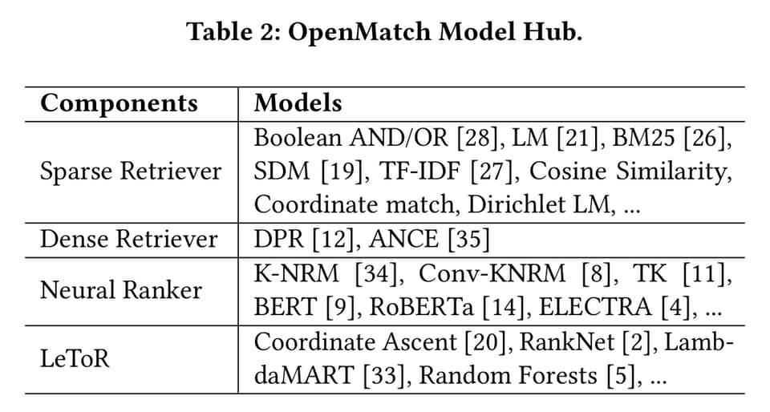

신경망의 눈부신 발전에 따라 여러 **검색 엔진들의 성능도 함께 개선**되었다는 포스트들을 많이 접해보셨을 것 같습니다.

> [Bing](https://blogs.bing.com/search-quality-insights/May-2018/Towards-More-Intelligent-Search-Deep-Learning-for-Query-Semantics): Towards More Intelligent Search: Deep Learning for Query Semantics

> [Google](https://blog.google/products/search/search-language-understanding-bert/): Understanding searches better than ever before

기존 `Term 기반 검색`의 경우, **시맨틱한 의미는 같지만 다르게 생긴 단어**가 포함된 문서를 찾아내기 어렵다는 한계를 지니고 있습니다. 예를 들어 사용자가 `아이패드 팔기`를 검색한 경우, 해당 의미를 `아이패드 판매`로 표현한 문서를 추출하기 어렵다는 것입니다.

이러한 Term 매칭 검색의 한계를 보완하기 위해서는 `아이패드 팔기`와 `아이패드 판매`가 의미론적으로는 유사하거나 같다는 사실을 검색 엔진이 알고 있어야 하며, 이러한 역할을 신경망 모델이 대신해줄 수 있습니다.

이는 쿼리와 다큐먼트를 신경망 모델을 통해 임베딩 시킨 후, 임베딩 된 벡터 간 유사도를 구하는 식으로 이루어지며 최근 사전학습 기반의 모델들이 문맥을 파악한 **Representation**을 학습할 수 있게됨에 따라 검색 엔진에 기여하는 바가 더 커졌다고 할 수 있습니다.

그러나 검색 대상이 되는 모든 문서와 쿼리를 비교하는 것은 너무나도 **비용이 많이 드는 작업**입니다. 따라서 대개 기존 `Term 매칭 방식`으로 검색의 범위를 줄인 후 (위 예의 경우 `아이패드`를 포함한 문서들만을 서브셋으로 모두 뽑아온다거나), 줄어든 범위 내 문서들만을 대상으로 `신경망 모델`을 활용하는 파이프라인을 많이들 활용하게 됩니다.

여기까지는 많은 분들이 아시는 내용이고, 결국 해당 파이프라인을 어떻게 효율적으로 구성할 것이냐가 화두가 될 것 같습니다. **칭화대학교**는 정보 검색, 정보 추출 분야에서 꾸준히 좋은 연구를 선보이는 기관입니다. **지식 그래프**와 같은 외부 리소스를 신경망 모델에 잘 녹여내기 위한 연구를 수행하기도 하고요.

|  |
|:-----:|
| OpenMatch 아키텍처 |

이러한 칭화대학교가 작년에 내놓은 [**OpenMatch**](https://github.com/thunlp/OpenMatch)는 앞서 설명드린 파이프라인을 잘 엮는 실험을 한 라이브러리입니다. `Term 매칭 검색`과 `시맨틱 검색` 그리고 시맨틱 검색된 문서들을 대상으로 한 `Reranking` 기법까지, 현재 기술 수준에서 **가장 이상적인 파이프라인**의 모습을 잘 스케치하였습니다.

|  |
|:-----:|
| OpenMatch에서 적용한 여러 트릭 |

또한 전통적으로 **IR을 연구**한 기관답게 시맨틱 기반 정보 검색 모델은 항상 **라벨링 된 데이터가 부족하다는 문제**를 잘 이해하고 있습니다. 그리고 이를 해결하기 위해 쿼리와 다큐먼트에서 엔티티를 추출해 **지식 그래프 정보를 검색 엔진에서 레버리지 하는 기법**에 대한 고민도 한 것으로 보입니다.

솔직히 논문에서 제시한 아키텍처를 보고 코드를 확인했을 때, 적잖은 실망을 했습니다 😅 코드 레벨에서는 논문에서 주장한 피쳐가 다 포함되지도 않은 것 같고, 아름답게 구현이 된건 더욱 아닌 인상입니다.

|  |
|:-----:|
| Pipeline 겸 허브 |

그럼에도 해당 프로젝트가 좋게 다가온 이유는 정보검색에 있어 **파이프라인을 어떻게 구성하는게 바람직한지** `(Sparse IR + Dense IR + Neural Reranker)`, 데이터가 현저히 부족한 태스크이니만큼 개선을 하기 위해서는 어떠한 트릭들을 활용해야 하는지 (_e.g. 지식 그래프 Integration, Data Augmentation for Weak Supervision dataset, ..._), 관련한 선행 연구와 기술은 어떠한 것들이 있는지에 대해 잘 담아주었기 때문입니다.

이같은 파이프라인은 단순 정보검색 뿐만 아니라 **Open-domain QA**, **Fact Check**, **Conversational Search** 등 외부 레퍼런스에 의존한 판단을 해야하는 다양한 태스크에서 활용될 수 있으므로, 혹시 이와 같은 파이프라인을 구성하셔야 하는 분들께 영감을 줄 수 있을 것 같습니다 ! 