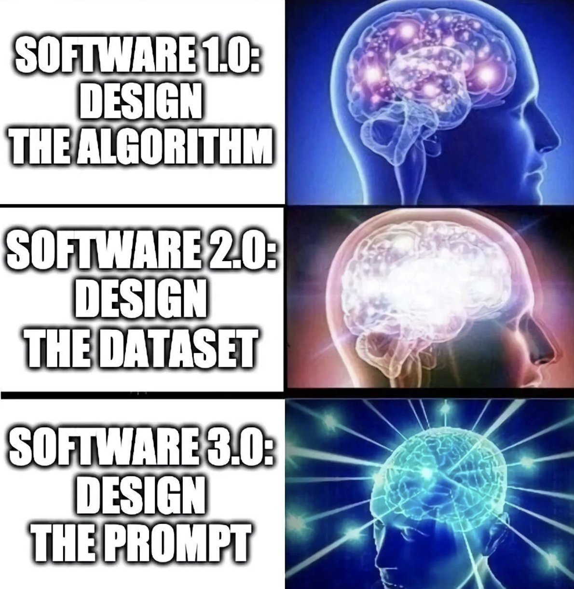
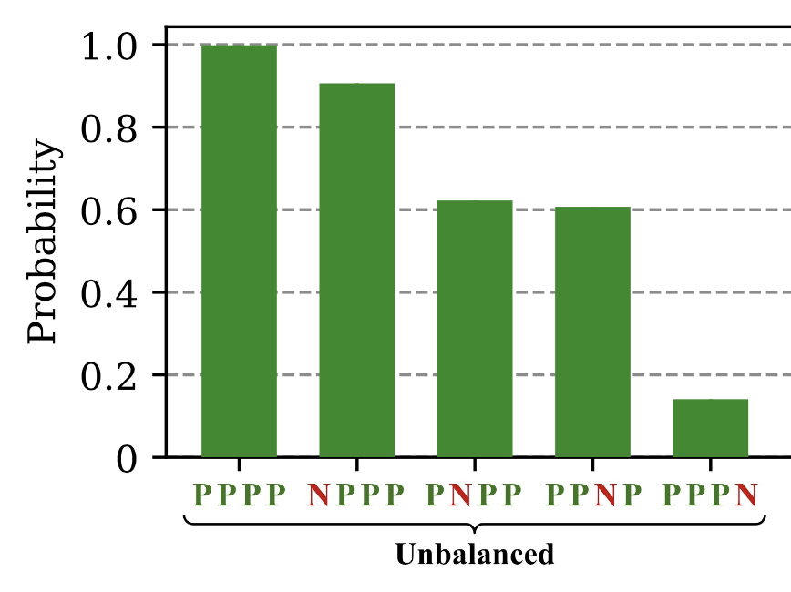
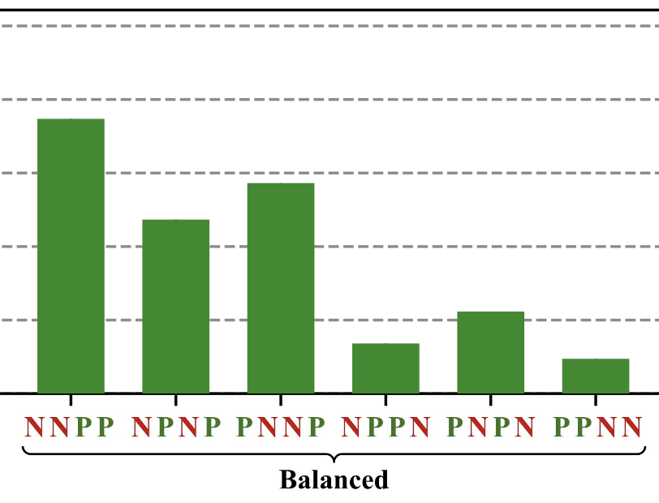
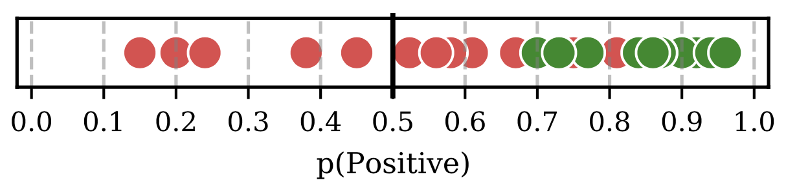
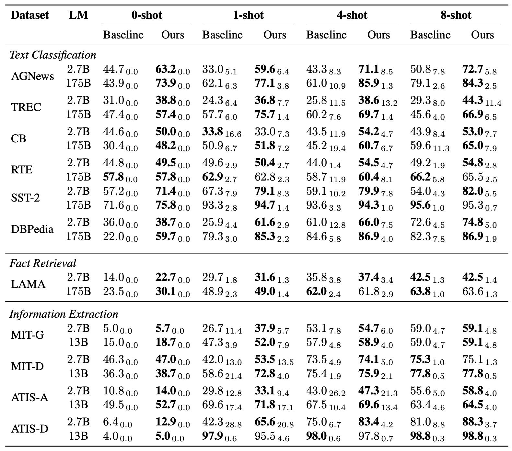
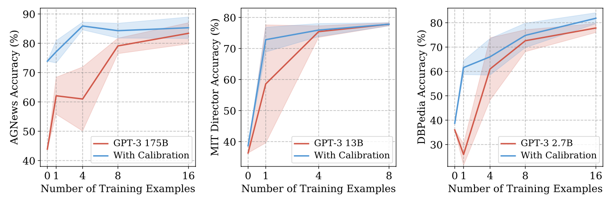

**OpenAI**는 [GPT-2](https://d4mucfpksywv.cloudfront.net/better-language-models/language_models_are_unsupervised_multitask_learners.pdf)와 [GPT-3](https://arxiv.org/abs/2005.14165)를 통해, **Large-scale Language Model**을 활용한 `Few-Shot Learning`의 가능성을 연달아 보여주었습니다. 특히 **GPT-3**가 논문을 통해 보여준 결과는 연구자들을 놀라게 하기에 [충분](https://syncedreview.com/2020/12/07/open-ais-gpt-3-paper-shares-neurips-2020-best-paper-awards-with-politecnico-di-milano-cmu-and-uc-berkeley/)했고, 연구 영역뿐만 아니라 서비스 단에서 **GPT-3** API를 활용한 **비즈니스 아이디어**를 고민하는 사람들도 점차 많아지고 있습니다.

|  |
|:-----:|
| GPT-3를 활용해 비즈니스 아이디어를 생성해주는 [예시](https://ideasai.net/) |

직접 활용해보신 분들은 더 크게 느끼셨겠지만 **방대한 양의 코퍼스**를 통해 학습된 **언어 모델** 답게 **GPT-3**는 웬만한 맥락의 프롬프트는 거뜬히 소화하는 모습을 보여줍니다. 여기서 *"소화한다"* 라는 표현은 다소 주관적일 수 있지만, 꼭 문장을 **이해한다**라기 보다는 학습 시 **다양한 맥락의 문장들을 관찰**했기에 프롬프트만 보고도 **"맥락에 맞는 문장을 생성 혹은 완성시킬 수 있다"**라고 이해해주시면 좋을 것 같습니다.

특히 **GPT-3**에서 제시된 **파라미터를 업데이트하지 않는** `In-Context Learning` 개념은 **상용단**까지 내다보게 되면 정말 많은 이점을 지니고 있습니다. 먼저, 프롬프트 수정만으로 **다양한 프로토타입을 실험**해볼 수 있습니다. 그리고 이 과정이 `텍스트`로만 이루어지기에 자연어 처리 지식이 없더라도 **프로토타이핑을 손쉽게 진행**할 수 있습니다. 마지막으로 `In-Context Learning`은 프롬프트 수정만으로 **동일한 모델이 여러 태스크를 수행**할 수 있게끔 설정할 수 있어 **시스템 복잡도를 크게 줄일 수 있다는 이점**도 있습니다. (서빙 현실성은... 할많하않 😷)

하지만 이처럼 편리해보이는 **프롬프트** 개념은 사실 **GPT-3**의 약점이 되기도 합니다. `Few-shot Learning` 세팅에서 **GPT-3**는 **프롬프트**를 보고 수행해야 할 작업을 이해하기 때문에 **프롬프트**를 잘 밀어넣어주는 것은 **GPT-3**를 잘 활용하기 위해 매우 중요한 작업입니다.



여기서 **잘 밀어넣어준다는 것**에는 **프롬프트의 포맷**, **예제의 등장 순서** 그리고 **예제의 개수** 등을 잘 조절해주어야 함이 내포되어 있습니다. **GPT-3**를 보고 **`Prompt Engineering` 패러다임**의 지평을 열었다는 우스갯소리가 나오는 이유가 이 때문이기도 하죠.

특히 앞서 언급한 **세 가지 특성**에 따라 모델 성능이 크게 차이나는 모습이 여러 번 관측됨에 따라 **GPT-3**가 제시한 `In-Context Learning`이 **불안정한 문제 해결 기법**이라는 주장도 등장했습니다. 하지만 모든 발전은 **정반합**으로 이루어지지 않겠습니까?

오늘 소개해드릴 [논문](https://arxiv.org/abs/2102.09690)은 **GPT-3**의 `In-Context Learning` 성능을 불안정하게 만드는 여러 `bias`들을 진단하고, 이를 완화하기 위해 **Calibration** 기법을 제시한 연구입니다.

논문에서 제시한 `In-Context Learning`을 저해하는 **세 가지 `bias`**는 다음과 같습니다: 제시된 *Example* 중, 많이 등장한 라벨을 따라간다는 **Majority Label Bias**, 마지막에 등장한 *Example*의 라벨을 따라간다는 **Recency Bias** 그리고 **사전 학습** 과정에서 자주 등장한 토큰을 더 높은 확률로 생성하려한다는 **Common Token Bias**.



먼저 **Majority Label Bias**를 살펴봅시다. 위 그림을 보면 알 수 있듯, **GPT-3**는 프롬프트를 통해 얻어진 *Example*들의 **라벨 분포**에 따라 예측을 결정하려는 경향이 있습니다. *Example*이 **긍정**으로만 구성되어 있으면, 다음 문장으로 무엇이 들어오든 **긍정**으로 내뱉으려고 하는 것이죠.

간혹 **`0-Shot`** 보다 **`1-Shot`**에서의 성능이 더 좋지 않게 측정되는 현상도 이러한 `bias` 때문입니다. **아무 것도 보지 않은 상황**에서 문제를 풀도록 하는게 **긍정** 혹은 **부정**으로 분류된 *Example* 하나로 인해 편향이 생기는 것보다 더 나을 수 있는 것입니다. 또한 왜 **고른 라벨 분포를 지닌 예제**들을 모델에 입력해주는게 중요한지 증명하는 관측이기도 하죠.



**Recency Bias**는 모델이 **가장 최근에 관측한 라벨을 더 선호**하는 편향을 의미합니다. 위 그림에서 보시다시피 모델은 **균형 잡힌** *Example*들을 관측했음에도, 가장 나중에 등장한 *Example*의 라벨을 따라 예측을 수행하는 것을 확인할 수 있었습니다. 특히 이 편향은 앞서 언급된 **Majority Label Bias** 보다 더 심각한데, `P P P N`과 같이 **긍정**이 다수로 제시되더라도 모델은 높은 확률로 마지막 *Example*을 따르는 예측을 합니다.

또한 위 `bias`는 모델에 여러 *Example*들을 부여할 때, **`Example`들을 나열하는 순서가 왜 중요한지**를 보여주는 관측이기도 합니다.

마지막으로 **Common Token Bias**는 토큰을 생성하는 과정에 있어 **사전 학습** 시 더 자주 관측한 토큰을 생성하려는 편향을 의미합니다. 예를 들어, `Saint Lucia`와 같이 **사전 학습** 과정에서 자주 관측하지 못했을 토큰을 생성해야 하는 상황에서, 모델은 `America`와 같이 자주 관측한 토큰을 생성하려는 편향을 보이게 됩니다.

이는 **분류** 문제에 있어서도 마찬가지인데, **사전 학습 코퍼스**에 *Negative*라는 단어보다 *Positive*가 더 자주 등장했다면 모델은 *Positive*를 더 높은 확률로 생성하고자 하게 될 것입니다. 해당 `bias`는 **프롬프트 템플릿**을 정함에 있어 **라벨명**을 잘 지어주는게 왜 중요한지와 더불어 **자주 등장하지 않은 명사**가 답이 되어야 하는 상황에서 왜 모델의 답변 정확도가 낮아지는지를 잘 보여주는 관측입니다.



지금까지의 관측으로 가정을 하나 세워보면, 결국 **GPT-3**가 지닌 세 가지 `bias`들은 `Output distribution`을 조정하는 것만으로 어느 정도의 완화가 가능합니다. 위 그림을 보면 `bias`를 지닌 모델이 높은 확률로 *Positive*를 생성하려고 함에 따라 **부정**의 문장들도 **긍정**으로 분류가 되고 있습니다. 따라서 **threshold**의 조정만을 통해 모델의 성능을 올려줄 수도 있겠다는 생각을 해볼 수 있게 됩니다.

그렇다면 어떤 방법으로 모델 결정에 **Calibration**을 적용할 수 있을까요? 논문에서는 *`Content-free Input`*이라는 개념을 제시합니다. 먼저 아래 예제들을 함께 보시죠.

```
Input: Subpar acting.   Sentiment: Negative
Input: Beautiful film.  Sentiment: Positive
Input: N/A              Sentiment:
```

**긍정**으로 분류된 문장과 **부정**으로 분류된 문장이 각각 주어진 상황에서 모델은 `N/A`라는 **아무 의미 없는 문장**의 *Sentiment*를 예측해야 합니다. 해당 상황에서 모델은 **어떤 예측**을 할까요? 이상적인 상황이라면 모델은 *Positive*와 *Negative*를 각각 `50%` 확률로 생성해야 할 것입니다. 그러나 어떤 `bias`가 영향을 미쳤건, 모델은 **두 라벨 중 하나에 더 높은** *logit*을 지니게 될 것입니다.

만약 위 *`Content-free Input`* 예제에서 *Positive*가 `61.8%`, *Negative*가 `38.2%`로 예측되었다면 앞으로 모델이 지닌 `bias`를 줄이기 위해서는 모델이 내리게 될 판단 중 *Positive*의 *logit* 값은 줄여주고, *Negative*의 *logit* 값은 키워주면 됩니다.

즉, 아무런 의미없는 *`Content-free Input`*을 모델에 입력했을 때 관측되는 **특정 라벨로의 편향**을 줄여주기 위해 `biased` 값을 역으로 활용하는 것이죠! 논문에서는 `["N/A", "", "[MASK]"]` 등의 토큰을 *`Content-free Input`*으로 활용하였으며, 각 토큰을 모델에 입력했을 때 **관측되는 편향**을 **Calibration**에 활용하였습니다.

|  |
|:-----:|
| GPT-3에 Calibration을 적용한 결과 |

논문에서는 **GPT-3** API를 활용하여, API가 내놓는 `logprobs`에 **Calibration**을 적용하는 실험을 진행했습니다. 결과를 보면 **Calibration** 적용 시, 대부분의 세팅에서 성능 개선이 발생함을 확인할 수 있습니다.



이뿐만 아니라 모델의 **최소 성능** 역시 개선되었고, *Example* 개수, 배치 등에 따른 **성능 편차**도 크게 감소되었습니다. 기존에 **Prompt Engineering**에 성능이 아주 크게 영향을 받던 모습에 비하면 보다 *Robust* 한 추론을 하게 되었다고 볼 수 있겠죠?

본 논문은 `In-Context Learning`을 제안한 **GPT-3**를 활용함에 있어, 적용과 구현이 아주 간단한 **Calibration** 기법을, 관측된 여러 `bias`의 특징에 맞추어 적용하여 모델의 성능 개선을 이끌어 낼 수 있음을 보여준 논문입니다. 뿐만 아니라 *Example* 구성에 따라 생기는 **성능 편차**를 **Calibration**을 통해 줄여주기도 했습니다.

개인적으로는 *`Content-free Input`*이라는 개념을 통해 모델이 지닌 `bias`를 미리 관측 및 기록한다는 발상 자체가 굉장히 좋게 느껴졌습니다. 저도 최근까지 **GPT-3** API를 활용할 일이 있었는데, 그때 논문에서 제시한 테크닉을 적용해보면 더 좋지 않았을까라는 생각을 했습니다. 물론 이러한 트릭에도 불구하고 **Prompt Engineering**에서 완전히 자유로워질 수는 없겠지만, *Robust* 한 세팅에 점점 더 가까워지고 있다는 사실에 감사하고 있습니다 😂

논문 내 실험에 활용한 **Calibration** 관련 코드는 모두 [저장소](https://github.com/tonyzhaozh/few-shot-learning)에 기록되어 있으니, 혹시 실험 중인 **GPT-2** & **GPT-3**에 적용해보실 분들은 참조하시면 좋을 것 같습니다!